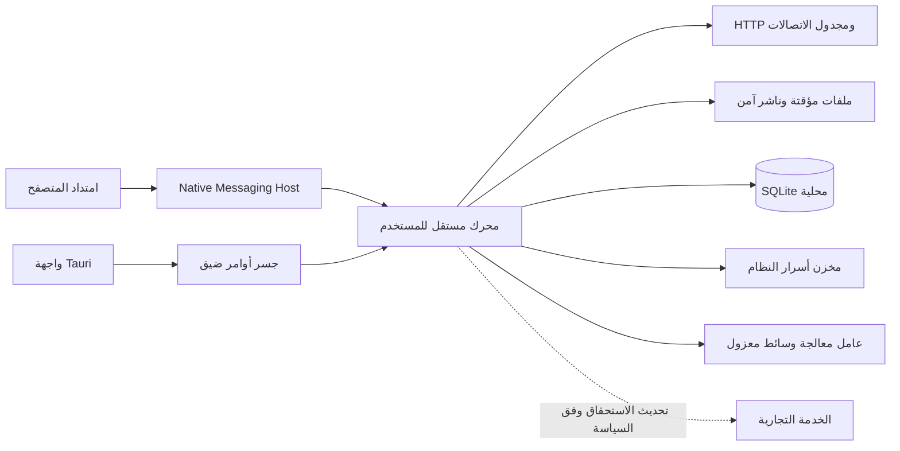
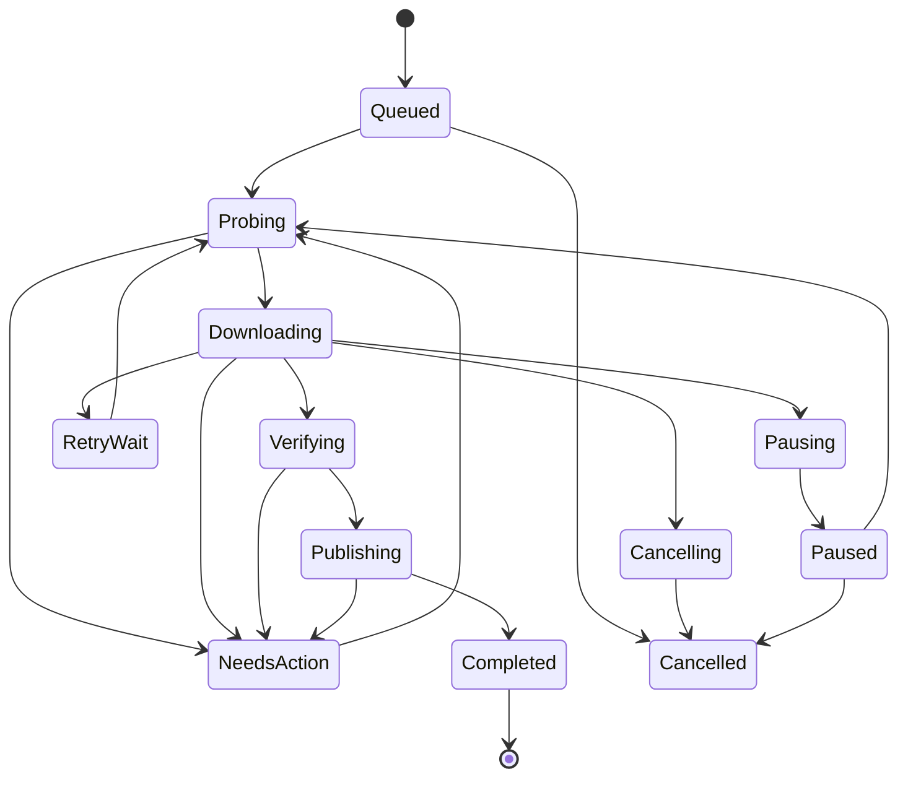

# المعمارية المستهدفة

التاريخ: 2026-09-21. الحالة: تصميم مرجعي موصى به للتنفيذ والتحقق، وليس وصفًا لنظام منفذ. المالك: الهندسة؛ اعتماد بوابات الجودة مسؤولية Product Owner. يقرأ مع [التوجه التقني](technical-direction.md) و[الأمن والاعتمادية](security-and-reliability.md).

## الهدف وحدود المنتج

منتج سطح مكتب تجاري بمستوى اعتمادية يناسب الاستخدام المهني على Windows وmacOS وLinux. كلمة enterprise هنا تعني سلامة البيانات، التحديث الموثوق، قابلية الدعم والإدارة، ونتائج اختبار قابلة للتدقيق؛ لا تعني أن SSO أو لوحة إدارة مؤسسات أو شهادات امتثال موجودة. هذه قدرات تجارية منفصلة تحتاج متطلبات وعقودًا وموارد.

نعتمد اتجاهًا محليًا أولًا: بايتات التنزيل والجلسات وسجل التنزيل تبقى على الجهاز. خدمة الاستحقاق لا تتوسط نقل الملفات. لا يرتبط استمرار مهمة محفوظة بتوافر خدمة التحليلات أو الترخيص.

## حدود العمليات

| المكون | المسؤولية | حدود الصلاحية والفشل |
| --- | --- | --- |
| الواجهة | عرض الحالة، إعدادات، إجراءات المستخدم، RTL والإتاحة | لا SQL ولا كتابة ملفات التنزيل ولا تنفيذ shell عام؛ تعطلها لا يوقف المحرك |
| المحرك | الحقيقة المرجعية، حالات المهام، الجدولة، الشبكة، متانة الملفات | عملية واحدة لكل ملف مستخدم؛ قفل حصري يمنع محركين من كتابة نفس الحالة |
| مضيف المتصفح | التحقق من أصل الإضافة وتحويل الرسائل | عملية قصيرة العمر؛ لا جلسات سرية في سطر الأوامر؛ لا يمنح صفحة الويب وصولًا مباشرًا للمحرك |
| عامل الوسائط | دمج/تحويل محدد لمهمة واحدة | عملية منفصلة مع مهلة وقيود موارد ومسارات مصرح بها؛ العزل ليس sandbox كاملًا إلا بعد تنفيذه على كل نظام |
| الخدمة التجارية | شراء، استحقاق، أجهزة، دعم عند الحاجة | واجهة مستقلة، لا URLs أو Cookies أو ملفات مستخدم ضمن طلب الترخيص |

الدفع في [الموقع التجاري](web-commerce.md) حصريًا: الموقع وخادم التجارة ومزود الدفع يديرون الطلب، ثم تحدث الخدمة الاستحقاق بعد تأكيد موثوق. التطبيق يفتح الموقع في المتصفح الخارجي ويجلب رخصته عبر خدمة مصادقة؛ لا يدير Checkout أو بيانات بطاقة ولا يثق بعنوان صفحة نجاح بوصفه إثبات دفع.

Rust وTokio وSQLite وTauri 2 مرشحون؛ تثبيت النسخ والتبعيات يأتي بعد تجربة عملية. تثبت تجربة دورة الحياة أن إغلاق الواجهة لا يقتل المحرك ضمنيًا، وأن الخروج الكامل يوقف المهام بأمان. لا نعد بالعمل أثناء نوم الجهاز أو تسجيل الخروج. تحديث المحرك ينتظر حاجز حفظ ثم يستخدم انتقالًا منظمًا؛ لا استبدال ثنائي يعمل على قاعدة مهاجرة.

## موضع التحقق من الاستحقاق

طبقة أوامر التطبيق الأصلية تتحقق من استحقاق موثق قبل بدء إجراءات مدفوعة جديدة، سواء جاء الطلب من الواجهة أو إضافة المتصفح أو أي عميل IPC. لا يكفي إخفاء عنصر في React، ولا يقبل حقل `isPaid` يرسله العميل. محرك النقل نفسه يبقى مستقلًا عن تفاصيل الدفع والشبكة التجارية، وتستمر إجراءات الحفظ والإيقاف الآمن والوصول إلى ملفات المستخدم عند تعطل الترخيص.

الخدمات التجارية تتحقق من الهوية والصلاحية وحالة الاستحقاق على الخادم لكل إجراء محمي، ولا تثق بقرار العميل. فصل المحرك عن الترخيص قرار قابلية صيانة واختبار، وليس ضمانًا ضد تعديل برنامج محلي. آلية الرخص الموقعة والمهلة وحدود إبطالها موثقة في [تصميم الترخيص](licensing-and-tamper-resistance.md).

## بروتوكول الاتصال المحلي

التوصية: Named Pipe على Windows وUnix Domain Socket على macOS/Linux، بصلاحيات المستخدم والتحقق من هوية الطرف حيث يوفر النظام ذلك. لا منفذ TCP عام. قيد المستخدم لا يحمي من كل برنامج خبيث يعمل بنفس حسابه؛ هذه حدود تهديد معلنة.

رسالة الأمر تتضمن `protocol_version` و`request_id` و`command` و`payload`؛ تستخدم العمليات القابلة للتكرار `idempotency_key` محفوظًا مع النتيجة. حدود أولية للتجربة: 256 KiB للرسالة، 1,000 عنصر لكل دفعة مع تقسيم صريح، ورفض أعماق JSON والأعداد غير الصالحة. هذه حدود منتج قابلة للتعديل بقياس الاستخدام وليست حدود Native Messaging الرسمية.

- مصافحة تعلن نطاق الإصدارات والقدرات؛ عدم التوافق يعرض تحديثًا مطلوبًا ولا يجرب أوامر مجهولة.
- `AddDownload` يرجع نجاحًا فقط بعد حفظ المهمة ومعرف منع التكرار. إعادة الرسالة تعيد نفس المهمة.
- `Pause` و`Cancel` إقراران مختلفان: استلام الطلب ثم بلوغ الحالة المستقرة. تظهر الواجهة الحالة الانتقالية.
- الأحداث لها رقم تسلسلي و`engine_epoch`؛ بعد فقد اتصال يحصل العميل على لقطة جديدة، ثم أحداث أحدث منها. التقدم المرئي غير سجل متانة.
- طابور محدود وضغط خلفي؛ دمج أحداث التقدم المكررة دون إسقاط أحداث الإكمال أو القرارات.
- تسليم المتصفح يؤكد الحفظ قبل أي محاولة إلغاء تنزيله. عدم القدرة على إلغاء المتصفح قد يسبب نسخة إضافية مع توضيح؛ لا ندعي exactly-once عبر نظامين بلا معاملة مشتركة.

Native Messaging يستخدم قائمة مصادر إضافات مسموحة، لكن التحقق من الرسائل في المضيف يظل ضروريًا. [توثيق Chrome الرسمي](https://developer.chrome.com/docs/extensions/develop/concepts/native-messaging). صلاحيات واجهة Tauri تمنح لكل نافذة بحدها الأدنى وتراجع تداخلاتها. [Tauri Capabilities](https://v2.tauri.app/security/capabilities/).

## نموذج البيانات

| السجل | الحقول الجوهرية |
| --- | --- |
| Download | UUID، حالة، generation، المصدر/الوجهة، سياسة إعادة المحاولة، أوقات، سبب التوقف |
| Representation | URL النهائي المحمي، strong ETag إن وجد، الحجم، الترميز، بصمة سياق الطلب دون تخزين السر فيه |
| DurableExtent | generation، بداية/نهاية حصرية، checksum محلي، checkpoint sequence |
| PublishIntent | هوية الملف المؤقت، الوجهة المحجوزة، الحجم والبصمة، مرحلة النشر |
| CommandReceipt | مفتاح التكرار، نوع الأمر، النتيجة، سياسة انتهاء الصلاحية |
| Settings / Rules | إصدار مخطط، أولويات، شروط، معاينة القاعدة، سياسة إدارية إن وجدت |

الأسرار تحفظ في مخزن نظام التشغيل؛ قاعدة البيانات تحفظ مراجعها. الروابط الموقعة نفسها قد تكون أسرارًا: تخزن محمية عند الضرورة ولا تظهر كاملة في التشخيص. المخططات ترقّم وتهاجر بمعاملات، مع نسخة احتياطية متسقة واختبار ترقية من كل إصدار مدعوم. الرجوع للثنائي القديم لا يفتح قاعدة أحدث إلا إذا كانت متوافقة صراحة.

## دورة الحالات

التعطل ينقل أي حالة غير نهائية إلى reconciliation عند التشغيل؛ ليس استكمالًا تلقائيًا بناءً على اسم الحالة. السياسة المحفوظة تحدد إن كان يستأنف بعد التحقق أو يبقى متوقفًا. فشل مؤقت له تأخير exponential backoff مع jitter وحد أقصى؛ انتهاء جلسة أو تغير المورد يحتاج إجراء مستخدم. الإلغاء لا يحذف ملفًا منشورًا أو ملفًا لم ننشئه. حذف الأجزاء قرار منفصل واضح، ويسمح بالاحتفاظ بها.

## HTTP والاستكمال

المرجع الدلالي: [RFC 9110، أقسام validators وIf-Range وRange](https://www.rfc-editor.org/rfc/rfc9110.html). `206` يحتاج نطاقًا صالحًا؛ `200` على طلب استكمال ليس جزءًا صالحًا للإلحاق؛ `If-Range` لا يستخدم weak ETag. التاريخ مقبول في البروتوكول بشروط قوة محددة؛ سياستنا الأولية أشد تحفظًا وتفضل strong ETag.

| الحالة المختبرة | قرار تصميم المنتج |
| --- | --- |
| strong ETag ونطاقات سليمة | طلب كل جزء بـIf-Range، تثبيت generation وتحقق offset/total/طول الجسم؛ رفض أي اختلاف |
| Range متجاهل ويرجع 200 | إيقاف تجزئة الجيل، عدم إلحاق الجسم؛ تنزيل جديد مستقل بعد توضيح فقد الاستكمال |
| weak ETag أو لا validator | تنزيل متصل واحد؛ إعادة التشغيل تبدأ جيلًا جديدًا افتراضيًا؛ لا دمج مستقل متعدد الطلبات غير مثبت الهوية |
| 416 | إعادة فحص الحجم والهوية؛ لا إعلان اكتمال لمجرد أن offset تجاوز الحجم |
| رابط جديد بعد انتهاء الصلاحية | مقارنة هوية تمثيل موثوقة؛ لا يكفي تساوي الاسم أو الحجم؛ عند الشك جيل جديد مع الاحتفاظ بالأجزاء القديمة |
| ضغط/ترميز مختلف | طلب identity وعدم فك ضغط تلقائي في مسار النطاقات؛ إن لم يوفر الخادم تمثيلًا متسقًا نستخدم مسارًا تسلسليًا جديدًا |
| خادم يكذب بشأن validator | checksum محلي لا يثبت أصالة المصدر؛ بصمة موثوقة خارج النقل تسمح بتحقق نهائي أقوى؛ لا ضمان ضد خادم خبيث |

لا نثبت دعم Range اعتمادًا على HEAD أو Accept-Ranges وحدهما. تُختبر طلبات فعلية، تحويلات محدودة العدد، مهلات الاتصال/الخمول، proxy، IPv4/IPv6، TLS، وأحجام مجهولة دون افتراض حجز مسبق. تمرير Authorization/Cookie إلى مصدر جديد ممنوع تلقائيًا. التجزئة تتكيف تحت سقف لكل مضيف وللمستخدم؛ لا تزيد الاتصالات عشوائيًا عند 429 أو بطء القرص.

## ترتيب حفظ البيانات ونشر الملف

`checkpoint` الخاص بالتنزيل يختلف عن SQLite WAL checkpoint. توصية البداية SQLite WAL مع synchronous=FULL وقاعدة على قرص محلي ومالك كتابة واحد؛ WAL لا يناسب قاعدة على filesystem شبكي، وFULL يزامن WAL عند commit. [SQLite WAL](https://www.sqlite.org/wal.html).

ثابت التصميم: لا يجوز أن تقول قاعدة البيانات إن نطاقًا متين قبل نجاح مزامنة بايتاته. تنفيذ دفعة الحفظ:

1. حجز نطاقات غير متداخلة داخل generation؛ إنهاء الكتابات الموجودة وإغلاق epoch الدفعة أمام كتابات جديدة عليه.
2. كتابة كل بايتات الدفعة ومعالجة short writes؛ حساب checksum لكل extent من البايتات المكتوبة.
3. مزامنة ملف البيانات بآلية النظام والتحقق من نجاحها؛ sync في الذاكرة أو flush لمكتبة الكتابة وحدهما لا يكفيان.
4. معاملة واحدة تسجل extents المتينة وحالتها وsequence. بعد نجاح commit فقط يحدث عداد التقدم الآمن.
5. فشل sync أو commit يبقي النطاق غير موثوق؛ يعاد التحقق/التنزيل عند الاستعادة. بيانات موجودة بلا سجل ليست دليل اكتمال.

توقيت الحفظ وحدوده يقاسان وفق كلفة القرص؛ لا رقم فقد تقدم مضمون حتى اختبار أعطال الطاقة. flush للنظام لا يضمن وحده سلوك جميع وحدات التخزين. [Microsoft: flushing buffered I/O](https://learn.microsoft.com/en-us/windows/win32/fileio/flushing-system-buffered-i-o-data-to-disk).

النشر: اكتمال النطاقات → مزامنة الملف → تحقق الحجم وبصمة موثوقة إن توفرت → حفظ PublishIntent → إعادة تسمية دون استبدال إلى اسم محجوز على نفس volume → تثبيت بيانات الدليل حسب النظام والـfilesystem → حفظ Completed. عند تعطل بين rename وcommit، يعيد reconciler التحقق من هوية الملف النهائي وبصمته ويكمل السجل دون التنزيل مجددًا. وجود ملف مختلف في الاسم المطلوب يوقف النشر ولا يكتب فوقه.

عبر volumes: نسخ إلى ملف مؤقت خاص داخل الوجهة، مزامنته والتحقق منه، ثم نشره محليًا؛ يبقى المصدر حتى تأكيد نجاح الوجهة. الأقراص الشبكية والقابلة للإزالة تحتاج مصفوفة دعم منفصلة؛ لا تنقل ضمانات القرص المحلي إليها. فحص extents عند استعادة غير نظيفة يتحقق من البصمات ويعيد فقط الأجزاء التالفة، مع مسار آمن أبطأ بدل ثقة عمياء.

## بوابات اعتماد المعمارية

- قتل الواجهة لا يوقف التنزيل، وقتل المحرك يعيد فقط التقدم المتين بعد التحقق.
- نجاح مصفوفة HTTP وحالات النشر وفشل القرص في وثيقة الأمن والاعتمادية.
- تجربة صلاحيات IPC وانتحال الإضافة وتوافق إصدارين متجاورين.
- قياس CPU/RAM/زمن الاستجابة/throughput على الأجهزة المعلنة، وتوثيق إعدادات الخادم والشبكة. لا ادعاء تفوق قبل التجربة المقارنة.
- إثبات تحديث موقّع وهجرة حالة وفشل تحديث واستعادة على الأنظمة الثلاثة؛ أي منصة غير مختبرة لا تعلن مدعومة.
