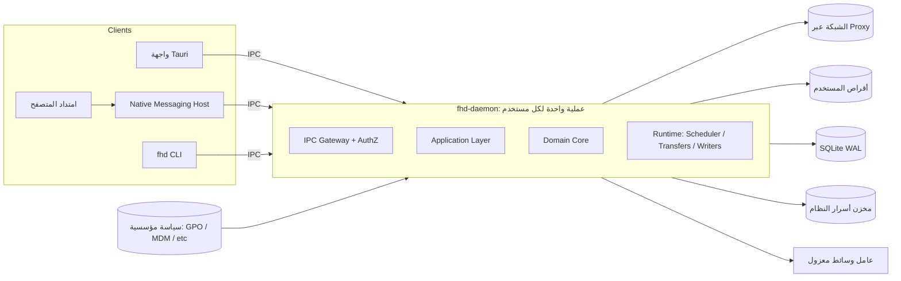
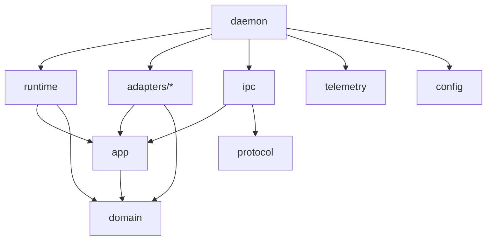
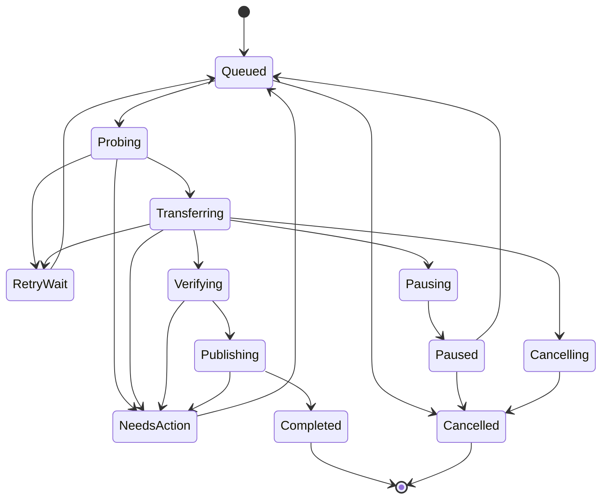
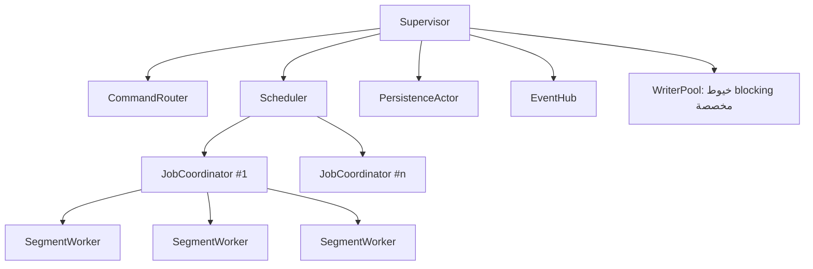
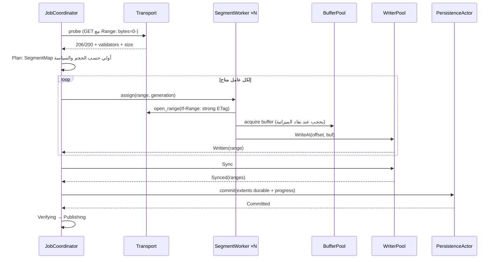
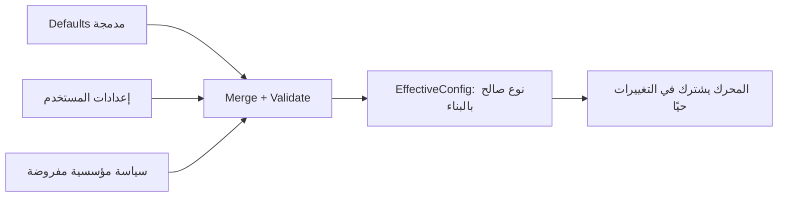

# معمارية محرك التنزيل المستهدفة (Enterprise)

التاريخ: 2026-09-21. الحالة: **تصميم مقترح لإعادة بناء كاملة**، غير منفذ. لا يلتزم بهيكل الكود الحالي؛ القسم الأخير يحدد ما يُنقل منه. يكمّل [المعمارية المستهدفة](architecture.md) (حدود العمليات والـIPC) ويحل محل أي تصميم داخلي للمحرك يخالفه بعد اعتماده.

## 1. ما الذي تعنيه enterprise هنا

خصائص جودة قابلة للقياس، وليست كثرة طبقات:

| الخاصية | المعيار المستهدف |
| --- | --- |
| سلامة البيانات | لا يُعلن بايت متينًا قبل fsync + commit؛ لا ملف منشور تالف؛ لا overwrite |
| الأداء | تشبع خط 1 Gbps بملف واحد، و CPU < 5% على جهاز مرجعي عند 100 MB/s |
| قابلية التوسع | 10,000 مهمة في السجل، 32 مهمة نشطة، 16 اتصالًا لكل مهمة، ذاكرة نقل ≤ 64 MiB إجمالًا |
| الإدارة المؤسسية | proxy وPAC وشهادات CA الداخلية، سياسات مفروضة (GPO/MDM)، قيود نطاقات ووجهات |
| قابلية الدعم | سجلات منظمة مع حجب الأسرار، رموز أخطاء ثابتة، حزمة تشخيص بموافقة المستخدم |
| قابلية الاختبار | كل منطق قرار قابل للاختبار دون شبكة أو قرص؛ اختبار انهيار وحقن أعطال آلي |
| قابلية التطور | عقود IPC ومخطط قاعدة بإصدارات وهجرات مختبرة؛ إضافة بروتوكول (FTP/وسائط) دون لمس النواة |

## 2. المبادئ الحاكمة

1. **Hexagonal (Ports & Adapters):** النواة لا تعرف reqwest ولا SQLite ولا نظام الملفات؛ تعرف traits فقط.
2. **مصدر حقيقة واحد:** آلة حالات المهمة في الدومين هي الوحيدة؛ لا نسخ موازية في المدير أو الواجهة.
3. **Parse, don't validate:** المدخلات تتحول عند الحدود إلى أنواع صالحة بالبناء (`JobSpec`, `ByteRange`, `OriginKey`)؛ لا حقول `pub` تسمح بحالة غير صالحة.
4. **مسار البيانات منفصل عن مسار التحكم:** البايتات تمر عبر قنوات محدودة وbuffer pool؛ الأوامر والحالة عبر actors.
5. **الضغط الخلفي في كل مكان:** كل قناة محدودة، كل طابور له سقف، كل مورد له ميزانية.
6. **Fail safe:** عند الشك نوقف ونطلب إجراء؛ لا نلحق بايتات غير مثبتة الهوية.
7. **الخصوصية بالتصميم لا بالصمت:** نسجل كل شيء مفيد، ونحجب الأسرار في طبقة واحدة موحدة.

## 3. طوبولوجيا العمليات



- **المحرك daemon مستقل** يعيش بعد إغلاق الواجهة، وله قفل حصري لكل مستخدم.
- **كل العملاء متساوون:** الواجهة ليست مميزة؛ تمر بنفس الـIPC والتفويض.
- **IPC:** Named Pipe على Windows، و Unix Domain Socket على macOS/Linux، مع التحقق من هوية الطرف (PID/SID/UID). لا TCP.

## 4. هيكل الـ Workspace

```text
crates/
  domain/            fhd-domain        نقي 100%: لا async ولا IO
  application/       fhd-app           حالات الاستخدام + تعريف المنافذ (traits)
  runtime/           fhd-runtime       actors: المجدول، منسق المهام، عمال المقاطع، الكاتب
  adapters/
    http/            fhd-http          Transport فوق hyper/reqwest، proxy، TLS
    storage/         fhd-storage       ملفات part، كتابة موضعية، نشر آمن
    persistence/     fhd-persistence   SQLite WAL، هجرات، repositories
    secrets/         fhd-secrets       DPAPI / Keychain / Secret Service
    platform/        fhd-platform      مساحة القرص، مسارات النظام، إشعارات
    policy/          fhd-policy        قراءة السياسات المؤسسية
  ipc/
    protocol/        fhd-protocol      أنواع العقد + الإصدارات (مشتركة مع العملاء)
    server/          fhd-ipc           النقل، المصادقة، التوجيه
  telemetry/         fhd-telemetry     tracing، حجب الأسرار، metrics، حزمة تشخيص
  config/            fhd-config        إعدادات طبقية مُتحقَّق منها
  bins/
    daemon/          fhd-daemon        composition root الوحيد
    cli/             fhd
    native-host/     fhd-native-host
  testkit/           fhd-testkit       fakes للمنافذ، محاكاة شبكة، حقن أعطال
```

### قاعدة الاعتماديات (يفرضها CI)



- `fhd-domain` بلا اعتماديات خارجية تقريبًا (لا tokio، لا reqwest).
- `fhd-app` يعرف `async-trait`/traits فقط، لا محولات.
- **المحولات لا تعتمد على بعضها.** الربط يحدث في `fhd-daemon` وحده.
- يُفحص ذلك آليًا (`cargo-deny` bans أو اختبار يقرأ `cargo metadata`).

## 5. طبقة الدومين (fhd-domain)

### الكيانات الأساسية

| النوع | المسؤولية |
| --- | --- |
| `Job` (aggregate root) | الهوية، `JobSpec`، الحالة، generation، سبب التوقف؛ كل تغيير عبر دالة ترجع أحداثًا |
| `JobSpec` | مصدر، وجهة، سياسة تحقق، أولوية، حدود — صالح بالبناء |
| `Representation` | URL نهائي (مرجع مشفر)، strong ETag، الحجم، Last-Modified، بصمة سياق الطلب |
| `SegmentMap` | خريطة نطاقات الملف: `Pending / InFlight(worker) / Written / Durable`؛ عمليات split/merge/steal |
| `Generation` | رقم يزداد عند تغير التمثيل؛ أي بايت من جيل قديم مرفوض |
| `ResumeDecision` | منطق RFC 9110 النقي (يُنقل من `resume-policy` الحالي) |
| `RetryPolicy` / `ErrorClass` | تصنيف الأخطاء وقرار الإعادة، بما فيه Retry-After و jitter |

### آلة الحالات الوحيدة



```rust
// الدومين يرجع أحداثًا، لا ينفذ IO
impl Job {
    pub fn handle(&mut self, cmd: JobCommand, now: Instant) -> Result<Vec<JobEvent>, DomainError>;
    pub fn apply(&mut self, event: &JobEvent);   // يُستخدم أيضًا لإعادة البناء من السجل
}
```

- كل انتقال يُختبر كجدول (state × command → result).
- `SegmentMap` مغطى بـ **property tests** (proptest): لا تداخل، لا فجوات، مجموع الأطوال = الحجم، Durable ⊆ Written.

## 6. المنافذ (fhd-app/ports)

```rust
#[async_trait]
pub trait Transport: Send + Sync {
    async fn probe(&self, req: ProbeRequest, cancel: &CancellationToken) -> Result<ProbeResponse, TransportError>;
    async fn open_range(&self, req: RangeRequest, cancel: &CancellationToken) -> Result<Box<dyn BodyStream>, TransportError>;
}

pub trait SegmentStore: Send + Sync {
    fn create(&self, job: JobId, gen: Generation, size: Option<u64>) -> Result<PartHandle, StorageError>;
    fn write_at(&self, part: &PartHandle, offset: u64, buf: &[u8]) -> Result<(), StorageError>;
    fn sync(&self, part: &PartHandle) -> Result<(), StorageError>;
    fn verify(&self, part: &PartHandle, expected: &Digest) -> Result<VerifyReport, StorageError>;
    fn publish(&self, part: &PartHandle, dest: &Destination, conflict: ConflictPolicy) -> Result<PublishedFile, StorageError>;
}

#[async_trait]
pub trait JobRepository: Send + Sync {
    async fn load_all(&self) -> Result<Vec<JobRecord>, PersistenceError>;
    async fn commit(&self, batch: UnitOfWork) -> Result<(), PersistenceError>; // ذري
}

pub trait SecretVault: Send + Sync { /* put / get / delete بمراجع SecretRef */ }
pub trait Clock: Send + Sync { fn now(&self) -> Instant; }
pub trait EntitlementGate: Send + Sync { fn check(&self, feature: Feature) -> Result<(), Denied>; }
pub trait PolicySource: Send + Sync { fn current(&self) -> EffectivePolicy; }
```

- `UnitOfWork` يجمع تغييرات حالة المهمة + extents المتينة + إيصالات الأوامر في معاملة واحدة.
- **Clock منفذ** لكي تكون اختبارات الإعادة والتأخير حتمية.
- الـ `EntitlementGate` يُستدعى في طبقة التطبيق عند قبول الأمر، **ليس** داخل مسار البايتات.

## 7. طبقة التطبيق (حالات الاستخدام)

CQRS خفيف:

| النوع | أمثلة | الضمان |
| --- | --- | --- |
| Commands | `AddDownload`, `Pause`, `Resume`, `Cancel`, `SetPriority`, `SetRate`, `RefreshSource`, `Remove` | تحقق مدخلات → تفويض → استحقاق → دومين → commit → رد. **idempotency_key** إلزامي للأوامر المنشئة |
| Queries | `ListJobs`, `GetJob`, `GetStats` | من read model في الذاكرة، لا تلمس القرص |
| Events | `JobStateChanged`, `Progress`, `Completed`, `NeedsAction` | رقم تسلسلي + `engine_epoch`؛ العميل يأخذ snapshot ثم يتابع |

كل handler دالة صغيرة مستقلة قابلة للاختبار بـ fakes، بدل حلقة `select!` ضخمة.

## 8. نموذج التشغيل (fhd-runtime)

### شجرة الإشراف



| Actor | يملك | ملاحظات |
| --- | --- | --- |
| `CommandRouter` | توجيه الأوامر للـ handlers | لا يحجب؛ كل عمل بطيء يُفوض |
| `Scheduler` | من يعمل الآن: أولويات، سقف عام، سقف لكل origin، ميزانية اتصالات | يستيقظ على أحداث أو `sleep_until(أقرب retry)`، لا polling |
| `JobCoordinator` | مهمة واحدة: probe، `SegmentMap`، توزيع العمال، checkpoints | خطأ فيه يُسقط المهمة فقط لا المحرك |
| `SegmentWorker` | اتصال HTTP واحد يقرأ نطاقًا ويرسل buffers | لا يلمس القرص إطلاقًا |
| `WriterPool` | خيوط OS قليلة تنفذ `write_at` و `fsync` | قناة محدودة = ضغط خلفي طبيعي على الشبكة |
| `PersistenceActor` | معاملات SQLite مجمعة (group commit) | كاتب وحيد للقاعدة |
| `EventHub` | توزيع الأحداث مع دمج التقدم | broadcast محدود، العميل البطيء يأخذ snapshot |

- **الإلغاء:** `CancellationToken` هرمي (`tokio-util`): المحرك ← المهمة ← المقطع. إلغاء الأب يلغي الأبناء.
- **لا `spawn_blocking` لكل chunk.** الكتابة تمر عبر `WriterPool` بقناة `mpsc` محدودة.
- **Supervisor** يعيد تشغيل actor فاشل بسياسة محددة، ويحول المهمة إلى `NeedsAction` مع سبب.

## 9. مسار البيانات: التنزيل المقطعي



### التقسيم التكيفي (كما تفعل مديرات التنزيل الاحترافية)

1. **البداية:** طلب probe واحد يصبح هو نفسه المقطع الأول (لا طلب مكرر).
2. **التقسيم الديناميكي:** عند فراغ عامل، يُقسم **أكبر مقطع متبقٍ** من منتصف الجزء غير المقروء، ويأخذ العامل النصف الثاني.
3. **حد أدنى للمقطع** (مثلًا 1 MiB) يمنع تشتيت الطلبات.
4. **سرقة العمل من العامل البطيء:** إذا كان معدل عامل أقل من نسبة من المتوسط، يُقسم نطاقه ويُعطى الجزء المتبقي لعامل أسرع.
5. **تكيف عدد الاتصالات:** زيادة تدريجية حتى يتوقف تحسن الإنتاجية أو يظهر 429/503 أو تتجاوز سقف الـ origin؛ خفض فوري عند الضغط.
6. **لا حاجز موجات:** كل عامل مستقل؛ الأبطأ لا يعطل الآخرين.

### الذاكرة والضغط الخلفي

- `BufferPool` بحجم ثابت (مثلًا 256 buffer × 256 KiB = 64 MiB) مشترك بين كل المهام.
- العامل الذي لا يجد buffer يتوقف عن القراءة ⇒ TCP window يضغط على الخادم. لا تراكم غير محدود.
- تحديد السرعة: **token bucket هرمي** (عام ← مهمة ← مقطع) مع سماح burst صغير، يُطبق على مستوى القراءة لا على بايت واحد.

## 10. نموذج التخزين والمتانة

### ملف part

- ملف واحد لكل generation: `<job-dir>/<gen>.part`، يُحجز حجمه مسبقًا عند معرفة الحجم (sparse حيث يدعم النظام، `fallocate`/`SetFileValidData` حسب الصلاحية).
- كتابة موضعية `pwrite` / `seek_write`. لا append.
- الحجم المجهول: مسار تسلسلي واحد، بلا استئناف إلا إن ظهر validator قوي لاحقًا.

### ثابت المتانة (Invariant)

> لا يُسجَّل extent على أنه `Durable` في القاعدة إلا بعد نجاح `fsync` لملف الـpart الذي يحتويه.

الترتيب: `write_at` → `Written` في الذاكرة → دفعة `sync` → `commit(extents)` في معاملة → تحديث التقدم المرئي.

- **Group commit:** تجميع checkpoints عبر المهام في معاملة واحدة كل X ميلي ثانية أو Y ميغابايت (قابل للضبط)، لتقليل fsync.
- **Checksum لكل block** (مثلًا 4 MiB) يُحفظ مع extent؛ عند استعادة غير نظيفة يُتحقق من الـblocks غير المؤكدة فقط ويعاد تنزيل التالف.

### التحقق والنشر

1. كل النطاقات `Durable` → hash كامل متدفق (SHA-256، مع دعم بصمة يقدمها المستخدم/الموقع).
2. `PublishIntent` يُحفظ قبل النشر.
3. نفس الـvolume: `rename` بلا استبدال (`renameat2(RENAME_NOREPLACE)` / `MoveFileEx` بدون `REPLACE_EXISTING` / `renamex_np(RENAME_EXCL)`)، ثم fsync للمجلد حيث يلزم.
4. volume مختلف أو نظام ملفات لا يدعم ذلك (FAT32/exFAT/SMB): نسخ إلى ملف مؤقت داخل الوجهة ← fsync ← تحقق ← rename محلي. **مسار fallback مختبر وليس فشلًا.**
5. تعارض الاسم: `Reject | Rename | Skip` حسب السياسة.
6. الـreconciler عند الإقلاع يكمل أي `PublishIntent` معلق بالتحقق من هوية الملف، دون تنزيل جديد.

### سياسة المسارات

- التحقق من الوجهة يعتمد على **المسار النهائي بعد canonicalize** وقائمة وجهات مسموحة، لا على رفض كل symlink/junction في الأسلاف (OneDrive ومجلدات Downloads المحولة و `/tmp` على macOS وجهات مشروعة).
- الحماية من سباقات المسار: فتح المجلد كـhandle ثم عمليات نسبية له (`openat` / `NtCreateFile` مع RootDirectory) في المحول فقط.

## 11. الاستمرارية (fhd-persistence)

- **SQLite WAL** + `synchronous=FULL` للمعاملات الحرجة، كاتب وحيد، قراء متعددون.
- **جداول لا snapshot:** كل تغيير يحدّث صفوفه فقط.

```sql
jobs(id PK, spec_json, state, generation, priority, reason_code, created_at, updated_at, version)
representations(job_id, generation, final_url_ref, etag, size, last_modified, context_fingerprint)
extents(job_id, generation, start, end_excl, block_checksums BLOB, committed_seq)
publish_intents(job_id, temp_path, dest_path, digest, stage)
command_receipts(key_hash PK, payload_hash, job_id, result, expires_at, removed)
settings(key PK, value, source)            -- user | policy
schema_migrations(version PK, applied_at, checksum)
```

- **الهجرات:** ملفات مرقمة، معاملة لكل هجرة، نسخة احتياطية قبل الترقية، اختبار ترقية من كل إصدار مدعوم في CI.
- **الأسرار (Cookies, Authorization, الروابط الموقعة):** في مخزن النظام عبر `SecretVault`؛ القاعدة تحفظ `SecretRef` فقط. هذا يلغي الحاجة لتشفير القاعدة كاملة ويعمل على المنصات الثلاث.
- **Optimistic concurrency:** عمود `version` يمنع كتابة حالة قديمة.

## 12. الشبكة (fhd-http)

| القدرة | التصميم |
| --- | --- |
| Connection pool | Client واحد مشترك في المحرك، keep-alive، HTTP/2 multiplexing، سقف اتصالات لكل host |
| Proxy | النظام (WinINET/macOS/env)، PAC/WPAD، يدوي، استثناءات؛ مصادقة Basic مدعومة، و NTLM/Kerberos **خطر مفتوح** يحتاج مكتبة أو تكامل OS وتقييم |
| TLS | مخزن شهادات النظام (`rustls-platform-verifier`) لدعم CA الداخلية وأجهزة TLS inspection؛ pinning اختياري بالسياسة |
| DNS | resolver النظام افتراضيًا، Happy Eyeballs، مهلات منفصلة |
| المهلات | connect / TLS / أول بايت / خمول القراءة — كلها من الإعدادات |
| الإعادة | تصنيف: `Transient` (reset, timeout, 5xx) / `Throttled` (429, 503 + Retry-After) / `UserAction` (401, 403, 410, رابط منتهٍ) / `Integrity` (تغير تمثيل) / `Fatal`. Exponential backoff + full jitter + احترام Retry-After |
| Circuit breaker | لكل origin: بعد فشل متتالٍ يُوقف مؤقتًا بدل إغراق الخادم |
| أمان الطلب | Authorization/Cookie لنفس الـorigin فقط؛ منع https→http؛ حد للتحويلات؛ رفض Content-Encoding غير identity في النطاقات؛ السياسة المؤسسية يمكنها منع عناوين IP الخاصة للطلبات القادمة من المتصفح (SSRF) |
| User-Agent | من الإعدادات، مع قيمة منتج نهائية وليست قيمة تطوير |

## 13. الأخطاء

- `thiserror` لكل طبقة: `DomainError`, `TransportError`, `StorageError`, `PersistenceError`, `AppError`.
- كل خطأ يحمل: `code` ثابت (مثل `NET-TIMEOUT-READ`, `DISK-FULL`, `SRC-CHANGED`)، `class` للإعادة، و context آمن (بدون URLs أو مسارات كاملة).
- `Display` للمستخدم يُولد في الواجهة من `code` بالعربية/الإنجليزية؛ المحرك لا يرسل نصوصًا حرة.
- لا `Error::Network` واحد يبتلع كل شيء: timeout ≠ DNS ≠ TLS ≠ reset، لأن القرار والرسالة يختلفان.

## 14. الإعدادات والسياسات المؤسسية



- **الأولوية:** السياسة المفروضة > المستخدم > الافتراضي. الإعداد المفروض يظهر مقفولًا في الواجهة مع مصدره.
- **مصادر السياسة:** Windows Registry (ADMX/GPO)، macOS Configuration Profiles (MDM)، Linux `/etc/fhd/policy.d/*.toml`.
- **أمثلة سياسات:** proxy إجباري، نطاقات مسموحة/ممنوعة، وجهات مسموحة، سقف سرعة، سقف اتصالات، منع HTTP، إيقاف التحديث التلقائي، إيقاف التليمتري، إلزام التحقق من البصمة لامتدادات معينة.
- كل قيمة لها نطاق مسموح في نوعها؛ إعداد غير صالح يُرفض عند التحميل مع سجل واضح، ولا يُطبق جزئيًا.

## 15. المراقبة والتشخيص (fhd-telemetry)

- **`tracing`** مع spans هرمية: `engine > job{id} > segment{idx}` و `command{kind,request_id}`.
- **طبقة حجب موحدة (redaction layer):** أنواع حساسة (`SecretUrl`, `Credential`, `UserPath`) تُطبع دائمًا مُقنّعة عبر `Debug`/`Display`؛ اختبار يفشل إذا ظهر سر في أي سجل.
- **سجلات محلية دوارة** بحد حجم؛ مستوى السجل قابل للتغيير حيًا.
- **Metrics داخلية:** الإنتاجية، إعادة المحاولات حسب code، زمن fsync، امتلاء BufferPool، طول القنوات — تُعرض في شاشة تشخيص.
- **حزمة تشخيص** يصدرها المستخدم صراحة: سجلات محجوبة + إعدادات فعالة + إصدارات + معلومات نظام، لإرسالها للدعم.
- **Crash reporting** اختياري بموافقة، بلا بيانات تنزيل.

## 16. الأمان

| حد الثقة | الضوابط |
| --- | --- |
| IPC | هوية الطرف من النظام، مصافحة بإصدار، حدود حجم/عمق، مخطط صارم، تفويض لكل أمر حسب نوع العميل (UI / extension / CLI) |
| امتداد المتصفح | يقترح فقط؛ لا يحدد مسارًا حرًا أو يمنح HTTP أو يرسل credentials دون موافقة المستخدم أو السياسة |
| الشبكة | انظر §12 |
| القرص | لا overwrite، تحقق الوجهة، أسماء ملفات منقاة لكل نظام، لا تنفيذ لأي ملف منزل |
| الأسرار | مخزن النظام + `zeroize` في الذاكرة + أنواع لا تطبع قيمتها |
| الاعتماديات | `cargo-deny` (تراخيص + bans + advisories)، `cargo-audit`، SBOM لكل إصدار، نسخ مثبتة |
| الوسائط | عملية منفصلة بمهلة وحدود موارد وملفات مصرح بها فقط |
| الكود | `#![forbid(unsafe_code)]` خارج `fhd-platform`؛ أي `unsafe` معزول بواجهة آمنة ومراجع |

## 17. استراتيجية الاختبار

| المستوى | الأداة | ما يثبت |
| --- | --- | --- |
| وحدة الدومين | اختبارات جدولية + `proptest` | آلة الحالات، `SegmentMap`، قرار الاستئناف والإعادة |
| حالات الاستخدام | fakes من `fhd-testkit` | الأوامر، idempotency، التفويض، دون شبكة/قرص |
| المحاكاة الحتمية | Transport وهمي + Clock وهمي | سيناريوهات: خادم يكذب، 200 بدل 206، تغير ETag، بطء عامل، 429 |
| المحولات | المختبر HTTP المحلي + أقراص حقيقية | proxy، TLS، HTTP/2، أنظمة ملفات مختلفة |
| حقن الأعطال | `SegmentStore` يفشل عند fsync/write/ENOSPC | المتانة لا تكذب |
| الانهيار | قتل العملية (`kill -9`) في نقاط عشوائية ثم إعادة التشغيل | لا ملف منشور تالف ولا تقدم وهمي |
| Fuzzing | `cargo-fuzz` | محللات الـheaders، الـIPC، فك السجلات |
| الأداء | `criterion` + اختبار إنتاجية على شبكة محلية | أهداف §1، ومنع التراجع |
| التوافق | ترقية القاعدة من كل إصدار، عميل IPC قديم/جديد | الهجرات والعقود |
| CI | مصفوفة Windows / macOS / Linux | fmt, clippy `-D warnings`, test, deny, audit, fuzz قصير، bench بحد تراجع |

## 18. ميزانيات وحدود افتراضية (قابلة للضبط بالسياسة)

| البند | الافتراضي | السقف |
| --- | --- | --- |
| مهام نشطة | 4 | 32 |
| اتصالات لكل مهمة | 8 (تكيفي) | 16 |
| اتصالات لكل origin | 8 | 32 |
| ذاكرة buffers | 64 MiB | 512 MiB |
| حد أدنى للمقطع | 1 MiB | — |
| فاصل group commit | 1 ثانية أو 64 MiB | — |
| حجم رسالة IPC | 256 KiB | — |
| تحويلات HTTP | 10 | 20 |

## 19. خطة إعادة البناء

### ما يُنقل من الكود الحالي (بعد المراجعة)

- `resume-policy` كاملًا ← `fhd-domain::resume`.
- تحقق URL وقواعد الـheaders الصارمة (`parse_url`, `validate_representation`, `length`) ← `fhd-http`.
- `RequestPolicy` (عزل credentials لكل origin، الحجب) ← `fhd-http` + `fhd-domain`.
- `validate_name` وقواعد أسماء Windows ← `fhd-platform` (نسخة واحدة).
- مختبر HTTP وسيناريوهات الاختبار الحالية ← `fhd-testkit` كحالات مرجعية.
- فكرة إيصالات idempotency وتصميمها ← `command_receipts`.

### ما يُستبدل

- `transfer-store` التسلسلي ← `fhd-storage` بكتابة موضعية و extents.
- `parallel.rs` بالموجات ← `JobCoordinator` بالتقسيم التكيفي.
- `manager.rs` ← `Scheduler` + `CommandRouter` + handlers منفصلة.
- `queue_store.rs` (snapshot مشفر كامل، Windows فقط) ← `fhd-persistence` بجداول + `SecretVault` متعدد المنصات.
- `download_core::state` الشكلي ← آلة الحالات الوحيدة في `fhd-domain`.

### المراحل

| المرحلة | المخرج | بوابة القبول |
| --- | --- | --- |
| 0. الأساس | workspace، قواعد الاعتماديات في CI، telemetry، config، testkit | CI أخضر على 3 منصات |
| 1. الدومين | `Job`, `SegmentMap`, resume، retry، أخطاء | property tests + تغطية جدول الانتقالات |
| 2. التخزين والاستمرارية | `fhd-storage`, `fhd-persistence`، هجرات | اختبارات حقن أعطال + kill -9 |
| 3. النقل | `fhd-http` مع proxy و TLS النظام | مصفوفة المختبر + proxy حقيقي |
| 4. التشغيل | Scheduler، JobCoordinator، WriterPool، BufferPool | أهداف الأداء §1 على الجهاز المرجعي |
| 5. الـIPC والعملاء | protocol، server، CLI، native host | توافق إصدارين، اختبارات تفويض |
| 6. المؤسسي | السياسات، حزمة التشخيص، ADMX/MDM | تطبيق سياسة مفروضة end-to-end |
| 7. التصلب | fuzz، benchmarks، مراجعة Security مستقلة | لا P0/P1 مفتوح |

## 20. مخاطر وقرارات مفتوحة

- **مصادقة proxy بـ NTLM/Kerberos:** غير مدعومة جاهزًا في مكتبات Rust الشائعة؛ تحتاج بحثًا (تكامل SSPI/GSSAPI أو مكتبة مخصصة) قبل الالتزام أمام العملاء.
- **الحجز المسبق للمساحة:** سلوك sparse و preallocation يختلف بين NTFS/APFS/ext4/exFAT؛ يُقاس لكل نظام.
- **أرقام الأداء في §1:** أهداف تصميم، لا نتائج؛ تُعتمد بعد القياس.
- **دعم أقراص الشبكة كوجهة:** مسار نسخ فقط، وضمانات متانة أضعف تُعلن للمستخدم.
- **عدد الـactors:** يُبدأ بالحد الأدنى المذكور؛ لا يُضاف actor دون حاجة مقاسة.
