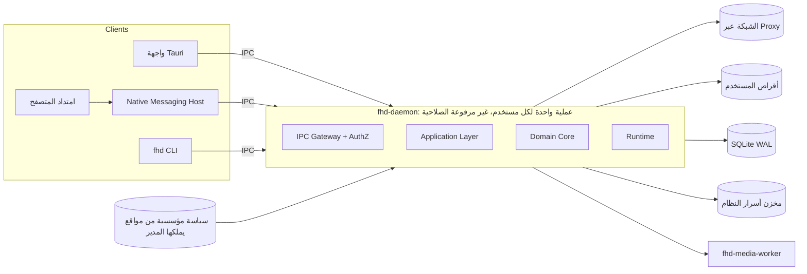
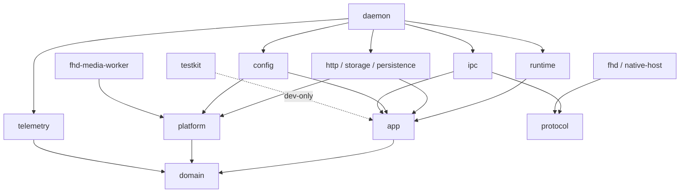
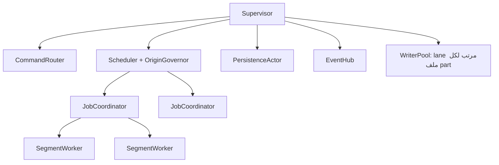
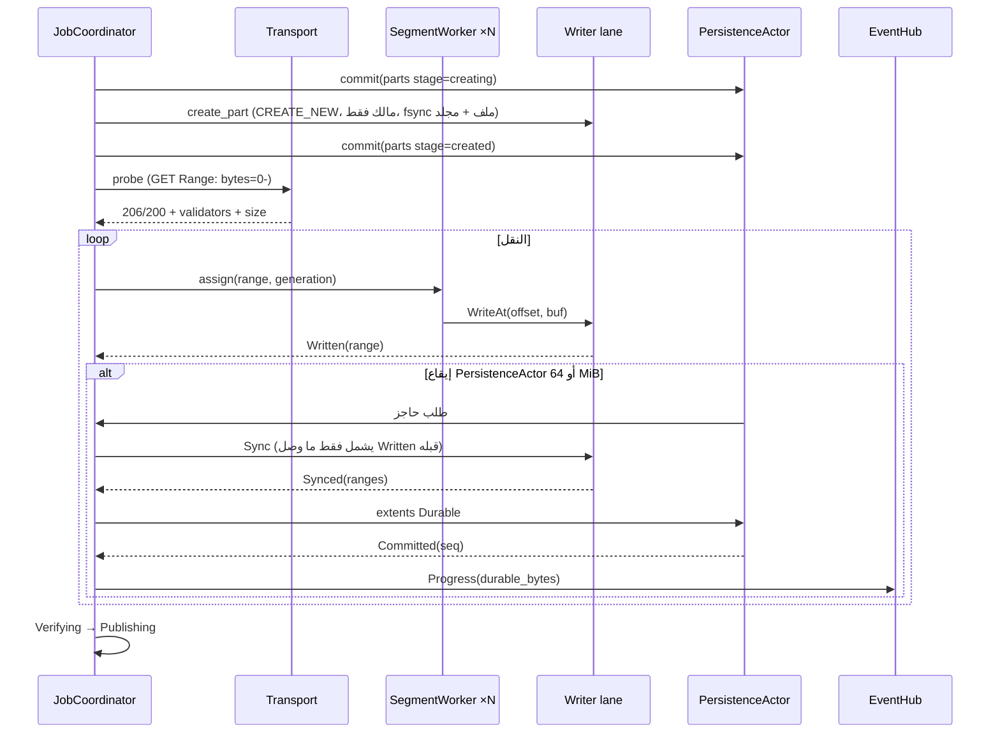

# معمارية محرك التنزيل المستهدفة (Enterprise)

التاريخ: 2026-09-22 (النسخة 4، بعد ثلاث جولات مراجعة مستقلة). تحديث وصف الحالة: 2026-09-23. هذه **معمارية مستهدفة قيد التطبيق الجزئي**؛ لا تعني أن كل ما تصفه منفذ أو مختبر. [سجل التطبيق](enterprise-implementation-status.md) يبين القدرات الفعلية والقيود والنسخة المرجعية؛ القسم21 يحدد خطة الانتقال. تكمّل [المعمارية المستهدفة](architecture.md) و[الأمن والاعتمادية](security-and-reliability.md). سجل المراجعات في القسم23. هذا تصحيح للحالة، ولا يعتمد أرقام الأداء أو القرارات التجارية المفتوحة.

> كل "ضمان" في هذه الوثيقة **هدف تصميم** حتى يثبت باختبار انقطاع الطاقة وحقن الأعطال على كل منصة ونظام ملفات معلن.

## 1. ما الذي تعنيه enterprise هنا

| الخاصية | الهدف (يُعتمد بعد القياس) |
| --- | --- |
| سلامة البيانات | لا يُسجَّل نطاق متينًا قبل مزامنة بايتاته؛ لا يُنشر ملف فشل تحققه؛ لا يُستبدل ملف موجود |
| الأداء | تشبع 1 Gbps بملف واحد على الجهاز المرجعي؛ المعالج أثناء النقل ≤ 10% من **نواة واحدة** لكل 100 MB/s، **دون** مرحلة التحقق النهائي (ميزانيتها في §10.5) |

> **تفسير معتمد (2026-09-23) لبند المعالج:** «دون مرحلة التحقق» تعني **التحقق النهائي وحده** — قراءة الملف كاملًا وتجزئته قبل النشر. أما **تجزئة نقاط التفتيش (بصمة كل نطاق) فتُحسب ضمن تكلفة النقل**، لأنها لازمة أثناء التنزيل نفسه لضمان الاستئناف، وليست مرحلة لاحقة. لذلك يُقيَّم بند المعالج على **الاستهلاك الكلي شاملًا تجزئة نقاط التفتيش**؛ والرقم الذي يستثنيها يبقى **للتشخيص فقط** لا للحكم. أرقام خط الأساس في [القياسات](engine-measurements.md).
| قابلية التوسع | 10,000 مهمة في السجل؛ الافتراضي 4 نشطة بذاكرة نقل 64 MiB؛ السقف 32 نشطة و64 اتصالًا إجمالًا بذاكرة ≤ 512 MiB (§19) |
| الإدارة المؤسسية | proxy وPAC، CA الداخلية، سياسات مفروضة من مواقع موثوقة، قيود نطاقات ووجهات |
| قابلية الدعم | سجلات منظمة بحجب موحد، رموز أخطاء بمعاملات، حزمة تشخيص من مخطط مسموح بمعاينة وموافقة |
| قابلية الاختبار | منطق القرار قابل للاختبار دون شبكة أو قرص أو وقت حقيقي |
| قابلية التطور | عقود IPC ومخطط قاعدة بإصدارات وهجرات مختبرة |

## 2. المبادئ الحاكمة

1. **Hexagonal (Ports & Adapters):** النواة لا تعرف reqwest ولا SQLite ولا نظام الملفات.
2. **مصدر حقيقة واحد:** آلة حالات المهمة في الدومين، وجدولها الكامل في §5.2 هو المرجع المختبر.
3. **Parse, don't validate:** أنواع صالحة بالبناء عند الحدود.
4. **فصل مسار البيانات عن مسار التحكم.**
5. **ضغط خلفي وميزانية لكل مورد.**
6. **Fail safe / fail closed:** عند الشك نوقف ونطلب إجراء.
7. **الخصوصية بالتصميم:** نص المكتبات الخارجية الحر لا يصل للسجل خامًا.
8. **حدود تهديد صريحة (§16.1):** برنامج خبيث بنفس حساب المستخدم خارج الحماية.
9. **البساطة أولًا:** لا تكيف ولا تجريد قبل أن يثبت القياس الحاجة (§20).

## 3. طوبولوجيا العمليات



### 3.1 الـ IPC وهوية الطرف

> **حالة التنفيذ (2026-09-23):** منفَّذ على المنصتين. Unix: مقبس في مجلد 0700 مملوك للمستخدم، `SO_PEERCRED` لكل اتصال، وفحص ملكية من العميل قبل إرسال أي بايت. Windows: الاسم بالـSID والجلسة، وDACL محمية للمالك و`SY` مع علامة نزاهة إلزامية تمنع الأدنى نزاهة، و`FIRST_PIPE_INSTANCE` و`PIPE_REJECT_REMOTE_CLIENTS`، وتحقق العميل من مالك الأنبوب بـ`GetSecurityInfo` مع `SECURITY_IDENTIFICATION`. ما يتصل بالـ`unsafe` كله في [`fhd-platform`](../crates/adapters/platform/src/lib.rs) وحدها كما تنص §4. **غير مختبر هنا:** الحجز من حساب آخر ومحاولة الفتح من sandbox؛ يلزمهما حساب ثانٍ. التفصيل في [سطح التحكم](enterprise-ipc.md).


| المنصة | نقطة الاتصال | ضوابط الخادم | تحقق العميل (قبل إرسال أي بايت) |
| --- | --- | --- | --- |
| Windows | `\\.\pipe\fhd-<SID المستخدم>-<session>` | DACL للمالك فقط تستبعد AppContainer وLow-IL صراحة، `PIPE_REJECT_REMOTE_CLIENTS`، `FILE_FLAG_FIRST_PIPE_INSTANCE` | الفتح بـ `SECURITY_SQOS_PRESENT \| SECURITY_IDENTIFICATION` (يمنع خادمًا مزيفًا من انتحال token العميل)، ثم `GetSecurityInfo` على handle الـpipe: المالك = SID المستخدم الحالي؛ لا ثقة بالـPID |
| macOS | مقبس داخل `$TMPDIR/fhd/` (مجلد لكل مستخدم، 0700) | `getpeereid` + audit token | المجلد والمقبس مملوكان للمستخدم و0700 |
| Linux | `$XDG_RUNTIME_DIR/fhd/`؛ عند غيابه `~/.local/state/fhd/run/` (0700) — **ليس `/tmp` أبدًا** | `SO_PEERCRED` | نفس فحص الملكية والصلاحيات |

- مسارات المقابس تُفحص ضد حد 104/108 بايت؛ عند التجاوز يُستخدم مسار أقصر داخل مجلد 0700 لنفس المستخدم.
- **الانتحال المسبق للاسم:** `FIRST_PIPE_INSTANCE` يكشفه فقط؛ عندها يرفض المحرك العمل ويُبلغ بتشخيص واضح (DoS معلن)، والحماية الفعلية هي تحقق العميل من المالك.
- **هوية الطرف تثبت "نفس المستخدم" فقط.** التفويض حسب نوع العميل ضابط ضد الأخطاء لا حد أمني. صلاحيات الامتداد مربوطة بالـNMH ومعرّف الإضافة في الـmanifest، والامتداد يقترح فقط (§16.2).
- **Windows:** عملية sandbox بنفس الحساب لا تفتح أنبوبنا (علامة النزاهة وقائمة الوصول)، **ولا** تستطيع انتحاله لعميلنا لأن العميل يتحقق من الوصف الأمني كاملًا لا من المالك وحده — ومالكُ ما تنشئه تلك العملية هو الحساب نفسه، فالمالك وحده لم يكن يكفي. اختبار سلبي يثبت رفض الوصف الذي تستطيع إنتاجه. **لا مكافئ منفَّذ على Linux (Flatpak).**

## 4. هيكل الـ Workspace

```text
crates/
  domain/        fhd-domain       نقي: لا async/IO/Instant؛ يضم أنواع البيانات الحساسة (SecretUrl, Credential, UserPath)
  application/   fhd-app          حالات الاستخدام + المنافذ + Cancel/ByteStream/BoxFuture/EffectivePolicy
  runtime/       fhd-runtime      actors
  platform/      fhd-platform     طبقة أساس: مسارات وhandles، أسماء، مساحة، أسرار، قراءة السياسة، MOTW، كشف sync roots
                                  — الموضع الوحيد المسموح فيه unsafe
  adapters/
    http/        fhd-http
    storage/     fhd-storage
    persistence/ fhd-persistence
  ipc/
    protocol/    fhd-protocol     أنواع العقد (لا تعتمد على شيء داخلي)
    server/      fhd-ipc
  telemetry/     fhd-telemetry    tracing، طبقة الحجب، metrics، الحزمة
  config/        fhd-config       دمج الإعدادات → EffectivePolicy
  bins/          fhd-daemon (composition root الوحيد)، fhd، fhd-native-host، fhd-media-worker
  testkit/       fhd-testkit      dev-dependency فقط
```

`fhd-platform` مرشح لأن يصبح "مكب كل شيء"؛ يُراجع حجمه عند كل مرحلة ويُفصل عند تباعد فعلي.

### 4.1 قاعدة الاعتماديات (يفرضها CI عبر `cargo metadata`)



- المنافذ لا تعرض أنواع tokio أو futures: `BoxFuture` و`Cancel` و`ByteStream` معرّفة في `fhd-app`.
- أنواع الحجب في `fhd-domain`، فيستخدمها الجميع دون اعتماد على `fhd-telemetry`.
- المحولات لا تعتمد على بعضها. `#![forbid(unsafe_code)]` في كل مكان عدا `fhd-platform`.

## 5. طبقة الدومين (fhd-domain)

### 5.1 الكيانات

| النوع | المسؤولية |
| --- | --- |
| `Job` (aggregate root) | الهوية، `JobSpec`، الحالة، generation، المحاولات، سبب التوقف؛ `handle(input, now) -> Vec<JobEvent>` |
| `JobSpec` | مرجع مصدر (`SecretRef`)، هوية الوجهة، سياسة تحقق، بصمة متوقعة، أولوية، حدود |
| `Representation` | مرجع URL نهائي، strong ETag، الحجم، Last-Modified، بصمة سياق الطلب |
| `SegmentMap` | `Pending / InFlight(worker, end) / Written / Durable`؛ split/steal/merge، نقاط محاذاة 1 MiB |
| `Generation` | يزداد عند تغير التمثيل أو فشل التحقق؛ بايتات جيل قديم مرفوضة |
| `ResumeDecision` | منطق RFC 9110 النقي |
| `RetryPolicy` | backoff أسي + jitter **لأخطاء المهمة فقط**؛ Retry-After وخنق الـorigin ملك `OriginGovernor` (§8) |
| `Timestamp` | وقت جداري UTC قابل للحفظ |

### 5.2 آلة الحالات الكاملة

الحالات غير النهائية: `Queued, Probing, Transferring, Stopping{then}, Paused, RetryWait, NeedsAction, Verifying, Publishing, Cancelling, Failed`.
النهائية: `Completed, Cancelled`.

`Stopping{then}` هو **المخرج الوحيد** من `Probing` و`Transferring` لأي سبب غير الاكتمال: ينتظر توقف العمال وتفريغ lanes الكتابة وآخر commit، ثم ينتقل إلى `then ∈ {Paused, Queued, RetryWait, NeedsAction, Failed, Verifying}`. لا عمال جدد لمهمة قبل خروجها من `Stopping`، ولا حالة مخفية خارج النوع. أولوية `then` عند تعارض الأسباب: `Failed > NeedsAction > RetryWait > Paused > Queued > Verifying`.

**الأوامر:**

| الحالة | Pause | Resume | Cancel |
| --- | --- | --- | --- |
| Queued | → Paused | تجاهل | → Cancelling |
| Probing | → Stopping{Paused} | تجاهل | → Cancelling |
| Transferring | → Stopping{Paused} | تجاهل | → Cancelling |
| Stopping{t} | then := max(t, Paused) | إن كان t = Paused: then := Queued، أو Verifying إن AllDurable؛ غير ذلك تجاهل | → Cancelling (بعد التوقف) |
| Paused | تجاهل | → Queued، أو → Verifying إن AllDurable | → Cancelling |
| RetryWait | → Paused | → Queued (يبقى خاضعًا لقيود OriginGovernor) | → Cancelling |
| NeedsAction | تجاهل | → Queued بعد إصلاح/Refresh | → Cancelling |
| Verifying | → Paused (يُعاد التحقق من البداية) | تجاهل | → Cancelling |
| Publishing | مرفوض `PUBLISH-IN-PROGRESS` | تجاهل | **مرفوض طوال Publishing** |
| Failed | تجاهل | → Queued (محاولات = 0) | → Cancelling |
| Cancelling | تجاهل | مرفوض | تجاهل |
| Completed / Cancelled | مرفوض | مرفوض | مرفوض |

**الأحداث الداخلية:**

| الحالة | الحدث → الانتقال |
| --- | --- |
| Queued | Scheduled → Probing |
| Probing / Transferring | ProbeOk → Transferring · AllDurable (من Transferring فقط) → Stopping{Verifying} · Preempt → Stopping{Queued} · **RepresentationChanged** (ETag تغير، 200 بدل 206) → Stopping{Queued} مع generation+1 · Transient/Throttled → Stopping{RetryWait} (الموعد من OriginGovernor) · UserAction/DiskFull/IoError → Stopping{NeedsAction} · Fatal → Stopping{Failed} |
| Stopping{t} | أي حدث خطأ أثناء التوقف يرفع then حسب الأولوية (RepresentationChanged يرفع generation ويجعله Queued إن كان أدنى) · WorkersStopped + LanesDrained + Committed → t (إن كان t = Verifying ولم يكتمل كل شيء → Paused) |
| RetryWait | Deadline (جداري) → Queued |
| Verifying | Ok → Publishing · **Mismatch → NeedsAction{Integrity}**؛ Resume العادي مرفوض، و`ReplaceRepresentation` (من NeedsAction/Paused/Failed) يرفع generation ويصفّر extents · IoError → NeedsAction · Fatal → Failed |
| Publishing | Published → Completed · Conflict/IoError/SharingViolation (بعد إعادات محدودة) → NeedsAction |
| Cancelling | CleanupDone → Cancelled · **CleanupFailed** (volume غير متصل) → Cancelled مع تسجيل part معلق في `parts` للـGC |

**Remove:** مسموح من `Completed/Cancelled/Failed/Paused/NeedsAction/Queued/RetryWait`. يحذف ملفات part دائمًا (بعد تأكيد المستخدم إن كانت كبيرة)، أو ينقل صفوف `parts` إلى حالة `orphaned` ليجمعها GC؛ لا يترك ملفًا مخفيًا بلا سجل. لا يحذف ملفًا منشورًا.

**الاستعادة بعد تعطل:** `Probing/Transferring/Stopping/Verifying → Paused` (أو `then` المحفوظ إن كان `NeedsAction/Failed`) (أو `Queued` حسب سياسة الاستئناف التلقائي) بعد reconciliation للـextents؛ `Publishing →` reconciler النشر (§10.6)؛ `Cancelling →` إعادة التنظيف؛ `RetryWait` يحتفظ بموعده الجداري.

الجدولان يُختبران كاملًا كبيانات (state × input)، و`SegmentMap` بـ **proptest**.

## 6. المنافذ (fhd-app/ports)

```rust
pub type BoxFuture<'a, T> = Pin<Box<dyn Future<Output = T> + Send + 'a>>;

pub trait Transport: Send + Sync {
    fn probe(&self, req: ProbeRequest, cancel: Cancel) -> BoxFuture<'_, Result<ProbeResponse, TransportError>>;
    fn open_range(&self, req: RangeRequest, cancel: Cancel) -> BoxFuture<'_, Result<ByteStream, TransportError>>;
}

pub trait SegmentStore: Send + Sync {
    fn create_part(&self, dest: &DestinationHandle, job: JobId, gen: Generation) -> Result<PartHandle, StorageError>;
    fn preallocate(&self, part: &PartHandle, size: u64) -> Result<(), StorageError>; // بعد الـprobe وفحوص الحجم
    fn write_at(&self, part: &PartHandle, offset: u64, buf: &[u8]) -> Result<(), StorageError>;
    fn sync(&self, part: &PartHandle) -> Result<(), StorageError>;
    fn hash(&self, part: &PartHandle, cancel: &Cancel, progress: &dyn Fn(u64)) -> Result<Digest, StorageError>;
    fn mark_origin(&self, part: &PartHandle, origin: &OriginMark) -> Result<(), StorageError>; // MOTW/quarantine
    fn publish(&self, part: &PartHandle, name: &SafeFileName, conflict: ConflictPolicy) -> Result<PublishedFile, StorageError>;
    fn remove_part(&self, part: &PartHandle) -> Result<(), StorageError>;
}

pub trait JobRepository: Send + Sync {
    fn load_all(&self) -> BoxFuture<'_, Result<Vec<JobRecord>, PersistenceError>>;
    fn commit(&self, batch: UnitOfWork) -> BoxFuture<'_, Result<CommitSeq, PersistenceError>>;
}

pub trait Clock: Send + Sync {
    fn monotonic(&self) -> MonoTime;
    fn wall(&self) -> Timestamp;
    fn sleep_until(&self, at: MonoTime) -> BoxFuture<'_, ()>;   // قابل للمحاكاة
}

pub trait SecretVault: Send + Sync { /* put / get / delete؛ تعيد Unavailable صراحة */ }
pub trait EntitlementGate: Send + Sync { fn check(&self, feature: Feature) -> Result<(), Denied>; }
pub trait PolicySource: Send + Sync { fn current(&self) -> PolicyState; } // Valid | LastKnownGood | Broken
```

## 7. طبقة التطبيق (حالات الاستخدام)

| النوع | أمثلة | الضمان |
| --- | --- | --- |
| Commands | `AddDownload`, `Pause`, `Resume`, `Cancel`, `Remove`, `SetPriority`, `SetRate`, `RefreshSource` | تحقق → تفويض → استحقاق → دومين → commit → رد؛ **idempotency_key** للأوامر المنشئة |
| Queries | `ListJobs(cursor, limit, filter)`, `GetJob`, `GetStats` | من read model؛ مؤشر مرتب بـ `(queue_rank, id)` ومثبت على رقم تسلسل حدث؛ DTO مختصر |
| Events | `JobStateChanged`, `Progress`, `NeedsAction`, `Completed` | بعد `Committed` فقط؛ رقم تسلسل + `engine_epoch` |

**إيصالات idempotency:**
- مفتاح الإيصال يولّده الـ**NMH** (لا الصفحة) من معرّف الإضافة + معرّف الطلب؛ الواجهة وCLI يولدان مفاتيحهما.
- سقف واحد لكل مستخدم (المستخدم هو الـprincipal الوحيد القابل للتمييز، §3.1)، مع **حد معدل** لطلبات الامتداد.
- tombstone بعد Remove بعمر محدود (TTL) أطول من أي نافذة إعادة لدى العملاء (افتراضيًا 30 يومًا)، ثم يُجمع. داخل العمر، إعادة المفتاح لا تعيد المهمة.
- عند امتلاء السقف: رفض واضح `RECEIPTS-FULL` مع تشخيص، لا إخلاء صامت.

التقدم عدادان: `written_bytes` للسرعة، `durable_bytes` للاستئناف.

## 8. نموذج التشغيل (fhd-runtime)



| Actor | يملك |
| --- | --- |
| `CommandRouter` | توجيه الأوامر، لا يحجب |
| `Scheduler` | من يعمل: أولويات، سقف المهام، **سقف اتصالات عام**، preemption؛ `Clock::sleep_until` لأقرب موعد |
| `OriginGovernor` | **السلطة الوحيدة** لكل origin: سقف اتصالات، Retry-After، تعليق مؤقت بعد فشل متتالٍ. **البداية: سقوف ثابتة + backoff على 429/503**؛ التكيف التصاعدي بعد القياس |
| `JobCoordinator` | مهمة واحدة: probe، `SegmentMap`، العمال، حاجز الـsync عند الطلب |
| `SegmentWorker` | اتصال واحد، لا قرص |
| `WriterPool` | خيوط OS؛ كل ملف part مربوط بـlane واحد مرتب |
| `PersistenceActor` | **يملك إيقاع group commit**: كل ثانية يطلب من كل JobCoordinator حاجز sync لما أصبح `Written`، ثم يجمع النتائج في معاملة واحدة؛ ومهمة تجاوزت 64 MiB غير متينة تطلب حاجزًا مبكرًا |
| `EventHub` | توزيع بعد الـcommit مع دمج التقدم |

الإلغاء هرمي (المحرك ← المهمة ← المقطع). الـSupervisor يعيد تشغيل actor فاشل ويحول المهمة إلى `NeedsAction`.

## 9. مسار البيانات: التنزيل المقطعي



ملاحظة: إن جاء الـprobe بحجم أو validators تغير الخطة، يُضبط حجم الـpart بعده؛ إنشاء الملف قبل الـprobe يسمح بفحص الوجهة مبكرًا. **فحوص الحجم** (المساحة الحرة، سقف السياسة، حد 4 GiB على FAT32) تجري بعد الـprobe وقبل `preallocate`؛ فشلها يُغلق الاتصال ويحذف الـpart الفارغ ويحوّل المهمة إلى `NeedsAction`.

### 9.1 التقسيم التكيفي

1. **Probe هو المقطع الأول** (`bytes=0-`)، لا طلب مكرر.
2. **حدود قابلة للتحريك:** `end` ذري يملكه المنسق؛ العامل يتوقف عنده ويُسقط ما بعده، وعلى HTTP/1.1 يعني ذلك إغلاق الاتصال.
3. **التقسيم:** عند فراغ عامل يُقسم أكبر جزء غير مقروء، بمحاذاة 1 MiB.
4. **العامل البطيء يُقلَّص لا يُقتل.**
5. **الاتصالات لا الـstreams:** النطاقات على اتصالات منفصلة، لا على اتصال HTTP/2 واحد.
6. **لا حاجز موجات.**
7. أنظمة ملفات بلا sparse (exFAT/FAT32، §10.2) تفرض كتابة **تصاعدية**: التقسيم يعمل لكن الكاتب يرتب، والذاكرة تحد التقدم خارج الترتيب؛ وإلا فمسار واحد.

### 9.2 الذاكرة والعدالة

- `BufferPool`: الافتراضي 64 MiB للإعداد الافتراضي (4 مهام × 8 اتصالات). **يتناسب مع الاتصالات النشطة** حتى السقف 512 MiB: حصة محجوزة = 2 buffers لكل اتصال نشط + مخزون مشترك.
- انتظار الـpool أو محدد السرعة لا يُحتسب في مهلة خمول القراءة. إن أغلق الخادم الاتصال أثناء الانتظار يُعاد فتح النطاق دون عده فشلًا، **لكن تكرار ذلك أكثر من N مرة للمقطع نفسه يُعد Transient** ويخضع للـbackoff، لمنع الدوران اللانهائي.
- تحديد السرعة: token bucket هرمي (عام ← مهمة) بسماح burst صغير.

## 10. التخزين والمتانة

### 10.1 موضع ملف part

الافتراضي: **داخل مجلد الوجهة** (نفس الـvolume، إعادة تسمية بلا نسخ)، بالشروط التالية:

| الجانب | الضابط |
| --- | --- |
| الاسم | `.fhd-<128 bit عشوائية>.part`، إنشاء بـ `CREATE_NEW` / `O_CREAT\|O_EXCL\|O_NOFOLLOW` نسبيًا لـhandle المجلد |
| الصلاحيات | **مالك فقط** (0600 أو DACL صريحة) أثناء التنزيل؛ عند النشر تُعاد الصلاحيات الموروثة من المجلد |
| الإخفاء | Windows: `FILE_ATTRIBUTE_HIDDEN`؛ النقطة وحدها لا تخفي |
| مجلدات المزامنة السحابية | كشف sync roots (`CfGetSyncRootInfoByPath` على Windows، FileProvider/iCloud على macOS، أنماط Dropbox/OneDrive المعروفة). عند الكشف: الـpart في **مجلد staging على نفس الـvolume خارج جذر المزامنة** (مجلد بيانات التطبيق إن كان على نفس الـvolume)؛ إن تعذر: سمات التجاهل (`com.dropbox.ignored`، لاحقة `.nosync` على iCloud) إن وُجدت، وإلا نسخ عند النشر. السياسة يمكنها فرض أحد الخيارات |
| برامج الحماية | القفل المؤقت على الـpart متوقع: إعادة محاولة محدودة لـ `SharingViolation` عند الكتابة والنشر، ثم `NeedsAction`؛ حذف AV للملف → `NeedsAction` برمز واضح |
| المجلدات المرفوضة | مجلد يمنح صلاحية كتابة/إنشاء لـprincipal **غير موثوق**. الموثوقون: المستخدم الحالي، SYSTEM، Administrators، TrustedInstaller، CREATOR OWNER، ومجموعة لا تضم إلا المستخدم (user-private group على Unix). مرفوض مثلًا: `C:\Users\Public`، ACE لـ Users/Everyone؛ على Unix: world-writable حتى مع sticky bit، أو group-writable لمجموعة بأعضاء آخرين. **Authenticated Users بصلاحية Modify على جذر قرص غير النظام** (افتراضي NTFS، مثل `D:\Downloads`) مقبول بعد تنبيه، لأن الـpart مالك فقط وإنشاءه بـ `CREATE_NEW` يمنع الاستيلاء على الاسم؛ السياسة يمكنها جعله مرفوضًا |
| الوجهة المرفوضة | لا يُنشأ فيها part ولا ملف مؤقت؛ الـpart في staging (§10.6.8) ويُنشر بالنسخ **فقط إن قبل المستخدم الوجهة صراحة**، وإلا `NeedsAction` برمز `UNSAFE-DESTINATION` |

- مسار **staging المنفصل** هو البديل الوحيد عند رفض الوجهة للـpart؛ إن كان على volume مختلف فالنشر نسخ (§10.6.8).
- كل part مسجل في جدول `parts` **قبل** إنشائه (§10.3)، فلا يوجد part بلا سجل.

### 10.2 قدرات أنظمة الملفات

| النظام | الحجز | Sparse | تسمية بلا استبدال | هوية ثابتة | ملاحظات |
| --- | --- | --- | --- | --- | --- |
| NTFS / ReFS | `FSCTL_SET_SPARSE` + `SetEndOfFile` (لا حجز فعلي؛ فحص المساحة إرشادي) | نعم | `FileRenameInfoEx` بلا REPLACE (عند عدم الدعم: `FileRenameInfo` بـ `ReplaceIfExists=FALSE`) | نعم (FileId 128 bit + CreationTime) | يُزال علم sparse بعد الاكتمال إن طُلب؛ دون sparse تفرض الكتابة البعيدة ملء أصفار |
| exFAT | `SetEndOfFile` | لا | نعم | **لا** | ملء أصفار حتى VDL ⇒ كتابة تصاعدية (§9.1.7) |
| FAT32 | `SetEndOfFile` | لا | نعم | **لا** | **حد 4 GiB للملف**: يُرفض قبل البدء بـ `FILE-TOO-LARGE-FOR-FS` |
| APFS / HFS+ | `F_PREALLOCATE` ثم `ftruncate` (APFS لا يضمن التجاور) | نعم (APFS) | `renameatx_np(RENAME_EXCL)`؛ عند `ENOTSUP`: `linkat`+`unlinkat` أو NeedsAction | نعم (inode + birthtime) | — |
| ext4 / xfs / btrfs | `fallocate(2)` مباشرة (لا `posix_fallocate` الذي يكتب أصفارًا)؛ عند `EOPNOTSUPP`: `ftruncate` | نعم | `renameat2(RENAME_NOREPLACE)` | نعم (inode + `statx` btime) | ext4 يعيد استخدام inodes بسرعة ⇒ الهوية تُقرن بوقت الإنشاء |
| NFS / SMB / FUSE | `ftruncate` | يختلف | `linkat`+`unlinkat` إن دُعم، وإلا → NeedsAction | **لا** | ضمانات متانة أضعف معلنة |

- **`SetFileValidData` و`NtSetInformationFile(FileValidDataLengthInformation)` ممنوعان** بفحص CI.
- قبل الحجز: فحص المساحة + سقف الحجم في السياسة؛ `ENOSPC` → `NeedsAction`.

### 10.3 ثابت المتانة

> لا يُسجَّل extent `Durable` إلا بعد (1) تسجيل `parts(stage=creating)` ثم إنشاء الملف وتزامنه هو ومجلده وتسجيل `stage=created`، و(2) نجاح `sync` لذلك الملف في نفس الـlane الذي نفذ كتاباته.

- Group commit يملكه `PersistenceActor` (§8).
- لا checksums لكل block (§20).

### 10.4 الاستئناف

`If-Range` مع **strong ETag** فقط. خوادم Last-Modified فقط: مسار واحد، والانقطاع يبدأ جيلًا جديدًا (قرار مؤجل §22).

### 10.5 التحقق

- `Verifying` يعيد قراءة الملف (المقاطع غير مرتبة)، قابل للإلغاء ويبلغ التقدم.
- الـhash الكامل إلزامي عند وجود بصمة متوقعة أو سياسة؛ وإلا الحجم + اكتمال `SegmentMap`.
- ميزانية: SHA-256 بتسريع العتاد ~1.5–2 GB/s لكل نواة، ومقيد بالقرص على HDD؛ أولوية منخفضة.

### 10.6 النشر والاستعادة

1. `PublishIntent` يُحفظ: الـpart، هوية الـpart **بحقول لا تتغير بالتسمية أو تعديل السمات** (volume + FileId 128 bit + CreationTime على Windows؛ inode + birthtime على macOS؛ inode + `statx` btime أو `i_generation` على Linux) والحجم والبصمة. لا يُستخدم ctime/ChangeTime لأن التسمية وتعديل الصلاحيات وMOTW تغيرها.
2. **MOTW/quarantine على الـpart قبل التسمية** (`mark_origin`)؛ `Zone.Identifier` و`com.apple.quarantine` يبقيان بعد التسمية على نفس الـvolume.
3. **تجهيز السمات النهائية قبل التسمية:** إزالة `FILE_ATTRIBUTE_HIDDEN`، واستعادة الوراثة بـ `SetSecurityInfo(... UNPROTECTED_DACL_SECURITY_INFORMATION)` على Windows، و`fchmod` إلى الصلاحية المشتقة من umask على Unix. الملف يبقى باسمه المؤقت العشوائي خلال هذه الخطوة القصيرة.
4. **كل اسم مرشح يُسجل في `publish_intents.target_name` مع `attempt` قبل محاولته**، ثم تسمية بلا استبدال **نسبية للـhandle**:
   - Windows: `SetFileInformationByHandle(FileRenameInfoEx)` على handle الـpart مع `RootDirectory` = handle المجلد ودون `REPLACE_IF_EXISTS`، ثم محاولة `FlushFileBuffers` على handle المجلد (أفضل جهد).
   - macOS: `renameatx_np(RENAME_EXCL)`؛ عند `ENOTSUP`: `linkat` ثم `unlinkat`، أو `NeedsAction`.
   - Linux: `renameat2(RENAME_NOREPLACE)`؛ عند `EINVAL` أو `ENOSYS` أو `ENOTSUP`: `linkat` ثم `unlinkat`.
   - عند عدم توفر أي عملية بلا استبدال (vfat/exFAT/FUSE دون روابط): `NeedsAction` برمز `NO-SAFE-PUBLISH` — لا تسمية قد تستبدل.
   - مزامنة المجلد بعد التسمية حيث يدعم النظام.
5. سياسة `Rename` عند التعارض: الاسم المرشح التالي (`name (n).ext`) يُسجل ثم يُحاول، بسقف.
6. بعد النشر (Windows): فحص AV اختياري عبر `IAttachmentExecute::Save` على خيط COM STA مخصص؛ إن حذف AV الملف → `NeedsAction`.
7. **الـreconciler متكرر وآمن للتكرار (idempotent)**، يعمل على آخر `target_name` مسجل:
   - الـpart موجود والمرشح غير موجود ⇒ يكمل من الخطوة 3 (أكثر حالات التعطل شيوعًا).
   - الـpart موجود والمرشح موجود **وهما نفس الملف** (تعطل بين `linkat` و`unlinkat`) ⇒ يزيل رابط الـpart.
   - الـpart موجود والمرشح موجود **وهما ملفان مختلفان** ⇒ يكمل سياسة التعارض بالمرشح التالي (`Rename`)، أو `NeedsAction` (`Reject`/`Skip`).
   - الـpart غير موجود والمرشح موجود ⇒ يقبل الهوية دون hash **فقط** على أنظمة الهوية الثابتة مع تطابق حقول الخطوة 1 والحجم؛ غير ذلك: hash إن وُجدت بصمة، وإلا `NeedsAction`.
   - **لا الـpart ولا المرشح موجودان** ⇒ يُبحث بالهوية بين المرشحين السابقين (حتميون: الاسم، ثم `name (1)` حتى `attempt`)؛ إن وُجد أُكمل، وإلا `NeedsAction` برمز `PUBLISH-LOST` (لا تنزيل تلقائي).
   - يتحقق من MOTW وإزالة الإخفاء واستعادة الصلاحيات، ويعيد تطبيق الناقص.
8. **مسار النسخ** (staging على volume مختلف، أو وجهة قبلها المستخدم صراحة وفق §10.1): نسخ إلى ملف مؤقت بنفس ضوابط §10.1 داخل الوجهة ← sync ← تحقق ← MOTW ← تجهيز السمات ← تسمية بنفس الخطوات 4–7.
9. على أنظمة بلا هوية ثابتة للمجلد (FAT/exFAT، أقراص الشبكة): إعادة فحص هوية المجلد عند النشر تُستبدل بإعادة فتحه مكوّنًا بمكوّن (§10.7) ومقارنة المسار المحلول، ويُعلن أنه أضعف.

### 10.7 سياسة المسارات

- جذور الوجهات المسموحة تُحل إلى **handles وهويات**، لا مقارنة نصوص.
- فتح كل مكون على حدة دون اتباع الروابط:
  - Linux: `openat2(RESOLVE_BENEATH | RESOLVE_NO_SYMLINKS)` (نواة 5.6+)؛ عند `ENOSYS/EPERM` (RHEL 8، حاويات seccomp): مشي مكوّن بمكوّن بـ `openat(O_NOFOLLOW | O_DIRECTORY)`.
  - macOS: `O_NOFOLLOW_ANY` (macOS 11+)، وإلا مشي مكوّن بمكوّن.
  - Windows: مشي مكوّن بمكوّن بـ `NtCreateFile` مع `ObjectAttributes.RootDirectory` = handle المكوّن السابق و`FILE_OPEN_REPARSE_POINT`، وفحص علامة الـreparse لكل مكون.
- **علامات reparse المسموحة** على Windows: `IO_REPARSE_TAG_CLOUD_*` (OneDrive Files On-Demand) وجذور مجلدات المستخدم المحولة التي تشير لنفس المستخدم بعد الحل؛ الروابط الرمزية وjunctions الأخرى ونقاط التحميل غير المتوقعة مرفوضة.
- هوية المجلد يعاد فحصها عند النشر.

## 11. الاستمرارية (fhd-persistence)

SQLite WAL + `synchronous=FULL` + `foreign_keys=ON`، كاتب وحيد، قاعدة على قرص محلي.

```sql
jobs(id PK, spec_version, spec_json, state, stopping_then, generation, priority,
     queue_rank /* فجوات: 1024 بين الرتب، إعادة ترقيم عند النفاد */,
     attempts, retry_at_utc, reason_code, reason_params_json,
     dest_volume_id, dest_file_id, expected_digest, created_at_utc, updated_at_utc)
representations(job_id REFERENCES jobs ON DELETE CASCADE, generation, final_url_ref, etag,
                size, last_modified, context_fingerprint, PRIMARY KEY(job_id, generation))
parts(id PK, job_id REFERENCES jobs ON DELETE SET NULL, generation, dir_volume_id, dir_file_id,
      name, file_id, stage /* creating|created|orphaned|removed */)
extents(job_id REFERENCES jobs ON DELETE CASCADE, generation, start, end_excl, committed_seq,
        PRIMARY KEY(job_id, generation, start))           -- تُدمج المتجاورة عند الـcommit
publish_intents(job_id PK REFERENCES jobs ON DELETE CASCADE, part_id, target_name, attempt,
                volume_id, file_id, birth_time, size, digest, stage)
command_receipts(key_hash PK, payload_hash, job_id, client_kind, created_at_utc,
                 expires_at_utc, removed)
settings(key PK, value)
schema_migrations(version PK, applied_at_utc, checksum)

CREATE INDEX jobs_sched   ON jobs(state, queue_rank);
CREATE INDEX jobs_retry   ON jobs(retry_at_utc) WHERE retry_at_utc IS NOT NULL;
CREATE INDEX receipts_exp ON command_receipts(expires_at_utc);
CREATE INDEX parts_stage  ON parts(stage);
CREATE INDEX parts_job    ON parts(job_id);
```

- `parts.job_id ON DELETE SET NULL` يحفظ سجل الـpart بعد Remove ليجمعه GC.
- **لا أسرار في القاعدة:** الروابط والرؤوس الحساسة `SecretRef`.
- **الهجرات:** مرقمة، معاملة لكل هجرة، نسخة احتياطية، اختبار ترقية من كل إصدار مدعوم.
- **GC دوري:** إيصالات منتهية، أسرار يتيمة، parts بحالة `creating/orphaned`. صفوف `creating` لا تملك file ID بعد، فتُطابق بالاسم العشوائي (128 bit) داخل handle المجلد المسجل، مع التحقق من أن الملف مملوك للمستخدم؛ صفوف `orphaned` بالهوية.
- قاعدة البيانات وملف WAL **لا يدخلان حزمة التشخيص**.

## 12. الشبكة (fhd-http)

| القدرة | التصميم |
| --- | --- |
| Connection pool | Client مشترك؛ السقوف بيد Scheduler/OriginGovernor؛ HTTP/2 للطلبات غير المقطعية |
| Proxy | إعداد النظام. PAC عبر مقيّم النظام: WinHTTP على Windows، CFNetwork على macOS، **libproxy في عملية مساعدة معزولة** على Linux (تقييم PAC داخل عملية المحرك ممنوع؛ لـlibproxy سجل ثغرات)؛ الـURL الممرر للـPAC يُجرد إلى `scheme://host/` لإخفاء الرموز الموقعة؛ WPAD معطل افتراضيًا؛ Basic مرفوض على اتصال proxy غير مشفر |
| NTLM/Kerberos | خطر مفتوح (§22) |
| TLS | مخزن شهادات النظام (`rustls-platform-verifier`)؛ لا تجاوز لشهادة غير صالحة؛ **الإبطال:** Windows وmacOS soft-fail (فشل الوصول لخادم الإبطال لا يمنع)، **Linux لا فحص إبطال** — يُعلن ذلك؛ pinning معطل افتراضيًا (يتعارض مع TLS inspection) ويُفعّل بسياسة |
| فلتر SSRF (مهام المتصفح) | **قائمة سماح لا قائمة حظر:** يُقبل فقط العنوان **القابل للتوجيه عالميًا** وفق سجلات IANA للأغراض الخاصة (IPv4 وIPv6). يرفض ذلك ضمنًا مثلًا `0.0.0.0/8`, `10/8`, `100.64/10`, `127/8`, `169.254/16`, `172.16/12`, `192.0.0.0/24`, `192.168/16`, `198.18/15`, `224/4`+، `::/128`, `::1`, `::/96`, `fc00::/7`, `fe80::/10`, `ff00::/8`. العناوين المضمِّنة لـIPv4 تُفك ويُفحص المضمَّن: `::ffff:0:0/96`، NAT64 `64:ff9b::/96` و`64:ff9b:1::/48`، 6to4 `2002::/16`، Teredo `2001::/32` |
| — دون proxy | الفحص في الـconnector **على العنوان الفعلي عند الاتصال** (ضد DNS rebinding)، ولكل تحويل واتصال جديد |
| — عبر proxy | العنوان المرئي هو الـproxy، فيُفحص **الهدف** قبل CONNECT/GET: رفض IP literals الخاصة، الأسماء أحادية المقطع، لواحق الإنترانت المعرّفة في السياسة، وأي مضيف يعيد له PAC `DIRECT` في شبكة مؤسسية؛ يتكرر لكل تحويل. هذا تخفيف لا ضمان: proxy يحل أسماء داخلية لن يُكشف كليًا |
| — الاستثناء | بسياسة أو بتأكيد المستخدم للمضيف النهائي |
| المهلات | connect / TLS / أول بايت / خمول القراءة — من الإعدادات |
| الإعادة | تصنيف `Transient / Throttled / UserAction / Integrity / Fatal`؛ Retry-After يُحفظ جداريًا ويملكه OriginGovernor |
| أمان الطلب | Authorization/Cookie لنفس الـorigin فقط؛ منع https→http؛ حد التحويلات؛ identity في النطاقات |

## 13. الأخطاء

- `thiserror` لكل طبقة؛ `reqwest::Error::without_url()`؛ لا رسائل `io::Error` بمسارات كاملة.
- كل خطأ: `code` ثابت + `class` + **معاملات منظمة**.
- الواجهة تبني الرسالة من `code` بالعربية/الإنجليزية مع تنسيق RTL.
- timeout ≠ DNS ≠ TLS ≠ reset.

## 14. الإعدادات والسياسات المؤسسية

- **الأولوية:** السياسة > المستخدم > الافتراضي؛ المفروض يظهر مقفولًا.
- **المصادر الموثوقة فقط:**
  - Windows: `HKLM\Software\Policies\FHD` **يغلب** `HKCU\Software\Policies\FHD`. الأخير محمي بـACL ولا يكتبه مستخدم عادي، ويكتبه GPO للمستخدم.
  - macOS: التفضيلات المُدارة فقط (`CFPreferencesAppValueIsForced`).
  - Linux: `/etc/fhd/` و`/etc/fhd/policy.d/` والملفات: مملوكة لـroot، غير قابلة للكتابة من group/others، ليست symlinks.
- **لا تُحفظ السياسة في القاعدة ولا في أي موقع يكتبه المستخدم.**
- **فشل التحليل:**
  - أثناء التشغيل: يبقى آخر سياسة صالحة في الذاكرة + حدث تشخيصي.
  - عند الإقلاع مع مصدر موجود وغير قابل للتحليل (لا LKG في الذاكرة): **fail closed** بملف تقييدي مدمج — لا مهام من المتصفح، لا مهام جديدة، المهام الموجودة متوقفة، وتشخيص واضح حتى إصلاح السياسة.
  - غياب المصدر كليًا = لا سياسة (الافتراضي).
- السياسة أمام مدير محلي ضابط امتثال لا حد أمني.

## 15. المراقبة والتشخيص (fhd-telemetry)

- `tracing` مع spans: `engine > job{id} > segment{idx}` و`command{kind,request_id}`.
- **الحجب:** أنواع `SecretUrl/Credential/UserPath` مقنّعة دائمًا؛ محوّل لأخطاء المكتبات؛ panic hook يحجب.
- **اختبار canaries** يغطي السجلات والحزمة وتقارير الانهيار (يغطي الـcanaries المعروفة لا كل سر).
- سجلات دوارة بحد حجم.
- **حزمة التشخيص من مخطط مسموح (allowlist) لا بالحذف من كل شيء:** حقول محددة من الإعدادات الفعالة (بلا مضيفات أو روابط أو بيانات proxy)، إصدارات، معلومات نظام، سجلات محجوبة. لا قاعدة بيانات ولا WAL. معاينة كاملة قبل التصدير.
- **تقارير الانهيار:** اختيارية بموافقة، stack-only.

## 16. الأمان

### 16.1 نموذج التهديد

| الخصم | الموقف |
| --- | --- |
| صفحة ويب خبيثة عبر الامتداد | **مُخفَّف:** اقتراح فقط، SSRF محظور افتراضيًا (مع حدود عبر proxy §12)، لا مسار حر، لا credentials دون تأكيد، حد معدل |
| خادم تنزيل خبيث أو شبكة معادية | **مُخفَّف:** TLS، رفض تغير التمثيل، حدود الحجم، MOTW. MOTW لا يمنع المستخدم من تشغيل ملف خبيث |
| مستخدم آخر على نفس الجهاز | **مُخفَّف على المنصتين:** Unix بالملكية والصلاحيات وSO_PEERCRED؛ Windows بالاسم المقيَّد بالـSID والجلسة وDACL للمالك وتحقق العميل من المالك. انتحال الاسم يبقى تعطيلًا معلنًا (يُكشف بـFIRST_PIPE_INSTANCE) ولا يصير تسريبًا، لأن العميل لا يكلّم أنبوبًا ليس مالكه. **غير مختبر:** حساب ثانٍ وsandbox. رفض الوجهات المشتركة غير منفَّذ؛ المنفَّذ: رفض الوجهة داخل شجرة المحرك وخارج جذر التنزيل (بمقارنة مسارات يحسمها نظام الملفات لا هجاؤها)، ورفض أسماء الأجهزة والامتدادات التنفيذية أينما وقعت والنقطة/المسافة في النهاية ومحارف قلب الاتجاه وفاصل البدائل `:`. **ليس كل §16.4**: كشف الامتداد المزدوج بمعناه العام غير منفَّذ |
| تطبيقات sandboxed بنفس الحساب (AppContainer، Low-IL، Flatpak) | **منفَّذ على Windows** بعلامة نزاهة إلزامية `(ML;;NRNWNX;;;ME)` على الأنبوب: ما دون Medium لا يفتحه. **غير مختبر** في هذه البيئة، ولا يوجد مكافئ منفَّذ على Linux (Flatpak) |
| برامج الحماية والمزامنة | ليست خصمًا لكنها تتدخل: القفل/الحذف → `NeedsAction`؛ المزامنة تُتجنب (§10.1) |
| برنامج خبيث بنفس حساب المستخدم | **خارج الحماية** |
| مدير محلي | **خارج الحماية**؛ السياسة ضابط امتثال |

### 16.2 الامتداد

يقترح URL ومعرّف طلب فقط؛ مفتاح الإيصال يولده الـNMH؛ حد معدل للطلبات. الوجهة والاسم وموافقة HTTP والـcredentials من الواجهة الموثوقة أو السياسة. لا يلغي ولا يحذف ولا يقرأ مهام أخرى.

### 16.3 الأسرار

- المخزن: DPAPI/Credential Manager، Keychain، Secret Service.
- **عند عدم التوفر:** أسرار في الذاكرة للجلسة فقط مع تنبيه؛ المحرك **لا يخرج عند الخمول** وهو يحمل أسرار جلسة؛ المهمة تصبح `NeedsAction` بعد إعادة التشغيل. لا ملف نصي.
- **منع التفريغ:** Linux `PR_SET_DUMPABLE=0` و`RLIMIT_CORE=0`؛ Windows `WerAddExcludedApplication` و`WerSetFlags(WER_FAULT_REPORTING_FLAG_NOHEAP)` (إعداد LocalDumps الذي يفرضه المدير خارج السيطرة ويُعلن)؛ macOS تعطيل core dumps للعملية.
- `zeroize` جهد أفضل (hyper/reqwest/rustls تنسخ).
- المخزن لا يحمي من برنامج بنفس الحساب أو من المدير.

### 16.4 الملفات المنزلة

- **MOTW:** على الـpart قبل التسمية (§10.6.2).
  - Windows: stream `Zone.Identifier`، والمنطقة بـ `IInternetSecurityManager::MapUrlToZone` (تحترم إعدادات مناطق المؤسسة: إنترانت = 1، الإنترنت = 3)، و`HostUrl`/`ReferrerUrl` دون query، ويمكن للسياسة تعيينهما `about:internet` إذا كانت المسارات تحمل رموزًا.
  - macOS: `com.apple.quarantine`.
  - FAT/exFAT لا تحفظ العلامة: تحذير للمستخدم.
- **تنقية الأسماء:**
  - حذف محارف التحكم ومحارف bidi (مثل U+202E).
  - كشف الامتدادات المزدوجة.
  - منع أسماء أجهزة Windows ونقاط/مسافات النهاية والـADS.
  - إعادة تسمية أو حظر `desktop.ini`، `autorun.inf`، `.url`، `.lnk`، `.library-ms`، `.search-ms`، `.searchConnector-ms`، `.scf`، `.theme`، `.themepack`، `.appref-ms`.
- المحرك لا يفتح أو ينفذ أي ملف منزل.

### 16.5 عامل الوسائط

`fhd-media-worker` **ليس sandbox** حتى يُنفذ العزل لكل منصة: AppContainer + Job Object على Windows، App Sandbox على macOS، seccomp + Landlock على Linux. يستلم file descriptors، بلا شبكة، بمهلة وحدود موارد.

### 16.6 سلسلة الإمداد والتحديث

- `cargo-deny`، `cargo-audit`، `cargo-vet`، `Cargo.lock` مثبت، SBOM وprovenance.
- **التحديث:** manifest موقع يحمل رقم إصدار متزايدًا؛ **عداد منع الرجوع** يُحفظ داخل مجلد التثبيت بجانب آخر manifest موقع مقبول (لا في القاعدة). **التحقق من التوقيع يسبق الـdrain**، وتُنفذ **نفس الملفات المتحقق منها** (لا إعادة قراءة من مسار قابل للتبديل بعد التحقق).
- التثبيت في مجلد المستخدم وmanifest الـNMH تحت `HKCU` قابلة للاختطاف من برنامج بنفس الحساب؛ معلن.

## 17. دورة حياة المحرك

| الموضوع | التصميم |
| --- | --- |
| الصلاحيات | **المحرك يرفض العمل مرفوع الصلاحية أو كـroot** (Windows: فحص Elevation/Integrity؛ Unix: `euid == 0` → خروج بتشخيص) |
| التشغيل عند الطلب | العميل يشغل المحرك بـ**مسار مطلق مشتق من موقع ملفه التنفيذي** (لا PATH ولا CWD)، ببيئة منقاة، دون وراثة handles، ومع breakaway من Job Object المتصفح؛ قفل حصري يمنع التكرار |
| التشغيل التلقائي | اختياري: Task Scheduler أو Run key، LaunchAgent، `systemd --user` |
| الخروج عند الخمول | بعد مهلة بلا مهام نشطة ولا عملاء ولا أسرار جلسة |
| التحديث الذاتي | تحقق من الحزمة ← drain (إيقاف القبول، Stopping{Paused} للكل، commit، **علامة "استئناف بعد التحديث" محفوظة**) ← خروج ← الثنائي الجديد يهاجر ← يستأنف ما حملته العلامة |
| النوم/الاستيقاظ | إسقاط الاتصالات، تصفير حالات OriginGovernor المؤقتة، إعادة الجدولة |
| قفزات الساعة | المهلات القصيرة أحادية؛ المواعيد المحفوظة جدارية ويعاد حسابها؛ انتهاء الروابط من رد الخادم |
| تعدد المستخدمين | محرك لكل مستخدم وجلسة؛ السياسة على مستوى الجهاز؛ الوجهات المشتركة مرفوضة |
| التنظيف | Cancel/Remove وGC وفق §5.2 و§11 |

## 18. استراتيجية الاختبار

| المستوى | الأداة | ما يثبت |
| --- | --- | --- |
| الدومين | جداول §5.2 كبيانات + `proptest` | آلة الحالات، `SegmentMap`، الاستئناف والإعادة |
| حالات الاستخدام | fakes من `fhd-testkit` | الأوامر، الإيصالات، التفويض |
| المحاكاة الحتمية | Transport وClock (مع `sleep_until`) وهميان | 200 بدل 206، تغير ETag، عامل بطيء، 429، إغلاق أثناء انتظار الـpool، قفزات الساعة، النوم |
| المحولات | مختبر HTTP + أقراص حقيقية | proxy وPAC (بما فيه libproxy)، TLS بـCA داخلية، مصفوفة §10.2 كاملة |
| حقن الأعطال | `SegmentStore` يفشل عند write/fsync/ENOSPC/SharingViolation | ثابت المتانة وحالات NeedsAction |
| الانهيار | `kill -9` في كل نقطة من §9 و§10.6 + انقطاع طاقة على عتاد مرجعي | الـreconciler متكرر، لا part بلا سجل، MOTW موجود دائمًا |
| الأمان | canaries، SSRF مباشرة وعبر proxy وrebinding وNAT64، انتحال الـpipe، عملاء AppContainer، سباقات symlink على كل مكون، أسماء bidi، مجلدات مزامنة، تشغيل مرفوع | §3، §10، §12، §16، §17 |
| Fuzzing | `cargo-fuzz` | الرؤوس، IPC، السياسة |
| الأداء | `criterion` + شبكة محلية | أهداف §1 |
| التوافق | ترقية القاعدة، عميل قديم/جديد | الهجرات والعقود |
| CI | Windows / macOS / Linux | fmt، clippy `-D warnings`، test، deny، audit، قاعدة الاعتماديات، منع APIs المحظورة، fuzz قصير، bench |

## 19. ميزانيات وحدود افتراضية (تُضبط بالسياسة)

| البند | الافتراضي | السقف |
| --- | --- | --- |
| مهام نشطة | 4 | 32 |
| اتصالات لكل مهمة | 8 | 16 |
| اتصالات لكل origin | 16 | 32 |
| **اتصالات إجمالية** | 32 | 64 |
| ذاكرة buffers | 64 MiB (2 × 256 KiB لكل اتصال + مشترك) | 512 MiB |
| محاذاة/حد أدنى للمقطع | 1 MiB | — |
| group commit | 1 ثانية، أو 64 MiB غير متين لمهمة | — |
| رسالة IPC | 256 KiB (القوائم مرقمة) | — |
| تحويلات HTTP | 10 | 20 |
| إيصالات idempotency لكل مستخدم | 4,096 | — |
| عمر tombstone | 30 يومًا | — |

## 20. ما أُزيل أو أُجّل عمدًا

- لا event sourcing؛ الأحداث للإشعار فقط.
- لا checksums لكل block.
- لا optimistic concurrency مع كاتب وحيد.
- لا circuit breaker مستقل؛ OriginGovernor السلطة الوحيدة، **بسقوف ثابتة أولًا**.
- لا سقوف إيصالات لكل principal (لا يمكن تمييزهم)؛ سقف واحد لكل مستخدم.
- كرايتات الأسرار والسياسة والمنصة مدموجة.

## 21. خطة إعادة البناء

### ما يُنقل من الكود الحالي

- `resume-policy` ← `fhd-domain::resume`.
- تحقق URL وقواعد الرؤوس ← `fhd-http`.
- `RequestPolicy` ← `fhd-http` + `fhd-domain`.
- `validate_name` وقواعد Windows ← `fhd-platform` (موسعة وفق §16.4).
- مختبر HTTP وسيناريوهاته ← `fhd-testkit`.
- تصميم إيصالات idempotency ← `command_receipts`.

### ما يُستبدل

- `transfer-store` ← `fhd-storage`.
- `parallel.rs` ← `JobCoordinator`.
- `manager.rs` ← `Scheduler` + `OriginGovernor` + `CommandRouter` + handlers.
- `queue_store.rs` ← `fhd-persistence` + `SecretVault`.
- `download_core::state` ← آلة الحالات الوحيدة.

### المراحل

| المرحلة | المخرج | بوابة القبول |
| --- | --- | --- |
| 0. الأساس | workspace، قاعدة الاعتماديات، telemetry والحجب، config، testkit | CI أخضر على 3 منصات |
| 1. الدومين | `Job` بالجداول الكاملة، `SegmentMap`، resume، retry، أخطاء | جداول §5.2 + proptest |
| 2. المنصة والتخزين والاستمرارية | `fhd-platform`، `fhd-storage`، `fhd-persistence` | مصفوفة §10.2، kill -9، سباقات المسارات، المزامنة وAV |
| 3. النقل | `fhd-http` مع proxy وPAC وTLS وSSRF | مصفوفة المختبر، proxy حقيقي، rebinding |
| 4. التشغيل | Scheduler، OriginGovernor، JobCoordinator، WriterPool، BufferPool | أهداف §1 |
| 5. الـIPC والعملاء ودورة الحياة | protocol، server، CLI، NMH، التشغيل والتحديث | انتحال، AppContainer، رفض الرفع، drain |
| 6. المؤسسي | السياسات وfail closed، حزمة التشخيص، ADMX/MDM | سياسة مفروضة end-to-end |
| 7. التصلب | fuzz، benchmarks، انقطاع الطاقة، مراجعة Security مستقلة | لا P0/P1 مفتوح |

## 22. مخاطر وقرارات مفتوحة

- مصادقة proxy بـ NTLM/Kerberos (SSPI/GSSAPI) قبل الالتزام أمام العملاء.
- SSRF عبر proxy يحل أسماء داخلية: تخفيف جزئي فقط (§12).
- فحص الإبطال في TLS: غائب على Linux وsoft-fail في غيره؛ قرار منتج مطلوب إن احتاج عميل مؤسسي hard-fail.
- كشف مجلدات المزامنة يعتمد على مزودين معروفين؛ مزود غير معروف قد يرفع ملفات part (الملف مالك فقط ومخفي).
- أنظمة FAT/exFAT: كتابة تصاعدية وبلا MOTW؛ الأداء أقل.
- خوادم Last-Modified فقط: قرار مؤجل.
- أقراص الشبكة: ضمانات أضعف.
- أرقام §1 و§19 أهداف تصميم.

## 23. سجل المراجعة

### الجولة الأولى — 2026-09-22 (على نسخة 2026-09-21)

32 ملاحظة من Engineering Agent وSecurity Agent (6 P0، 15 P1، 11 P2)، عولجت في النسخة 2. أبرزها: حظر `SetFileValidData`، جدول الحالات، ترتيب المتانة، موضع الـpart، المسارات بالهوية، هوية الطرف، SSRF، الأسرار، الحجب، MOTW، السياسة، TLS/PAC، قاعدة الاعتماديات، دورة الحياة.

### الجولة الثانية — 2026-09-22 (على النسخة 2)

قرار المراجِعَين كليهما: **اعتماد مع تعديلات**. التحقق من الجولة الأولى: Engineering وجد 10 بنود "جزئية"، وSecurity وجد 10 "جزئية". عولجت في هذه النسخة 3:

| # | المصدر | الأولوية | الملاحظة | المعالجة |
| --- | --- | --- | --- | --- |
| R2-1 | Eng | P0 | حالة مخفية في Pausing، غياب RepresentationChanged وأخطاء IO من Pausing/Verifying | `Pausing{then}` وجدول الأحداث §5.2 |
| R2-2 | Eng | P1 | Cancel يتجاوز التنظيف، Remove يترك part مخفيًا، Failed "نهائية" تقبل Resume | كل Cancel عبر Cancelling، `CleanupFailed`، Failed غير نهائية، `parts ON DELETE SET NULL` §5.2، §11 |
| R2-3 | Eng | P1 | part يتيم بين الإنشاء والتسجيل | `parts(stage=creating)` قبل الإنشاء §10.3 |
| R2-4 | Eng + Sec | P1 | MOTW بعد التسمية ولا يعاد عند الاستعادة | MOTW على الـpart قبل التسمية، والـreconciler يتحقق §10.6 |
| R2-5 | Sec | P1 | part في الوجهة: صلاحيات موروثة، مزامنة سحابية، أسماء متوقعة، إخفاء، AV | §10.1 |
| R2-6 | Eng + Sec | P1 | استعادة النشر: NeedsAction بدل إعادة التسمية، هوية غير ثابتة، link/unlink، ENOSYS، APIs مسارية | reconciler متكرر، هوية فقط على أنظمة ثابتة + ctime، APIs بالـhandle §10.6 |
| R2-7 | Eng | P1 | جدول الحجز غير دقيق، exFAT/FAT32، `posix_fallocate` | مصفوفة أنظمة الملفات §10.2 |
| R2-8 | Eng | P1 | أرقام الذاكرة والاتصالات متناقضة، ولا سقف إجمالي | §1، §9.2، §19 |
| R2-9 | Eng | P1 | فجوات المخطط (PK، فهارس، FK، الرتب، هوية الوجهة) | §11 |
| R2-10 | Sec | P1 | SSRF عبر proxy ونطاقات ناقصة | §12 |
| R2-11 | Sec | P1 | موضع LKG للسياسة غير محدد | fail closed §14 |
| R2-12 | Sec | P1 | تشغيل المحرك مرفوعًا، مسار التشغيل، التحقق قبل drain، عداد منع الرجوع | §16.6، §17 |
| R2-13 | Sec | Partial | openat2 وmacOS/Windows لا يغطيان كل المكونات؛ علامات reparse | §10.7 |
| R2-14 | Sec | Partial | الـpipe: تحقق العميل بـGetSecurityInfo، غياب XDG، مجلد macOS، حد طول المسار | §3.1 |
| R2-15 | Sec | Partial | IAttachmentExecute والمناطق، ملفات NTLM إضافية، أولوية HKLM، ملكية `/etc/fhd`، libproxy، تجريد URL للـPAC، الإبطال | §12، §14، §16.4 |
| R2-16 | Sec | P2 | إيصالات: استنزاف السقف، tombstone "دائم" | مفتاح من NMH، حد معدل، TTL §7 |
| R2-17 | Sec | P2 | بقايا الأسرار في dumps، حزمة بالحذف، الخروج عند الخمول | §15، §16.3، §17 |
| R2-18 | Sec | P2 | مبالغة في جدول التهديد | "مُخفَّف" وصفوف جديدة §16.1 |
| R2-19 | Eng | P2 | حواف الاعتماديات، BoxFuture، hash بلا إلغاء، Clock بلا مؤقت | §4، §6 |
| R2-20 | Eng | P2 | من يملك إيقاع الـsync، الدوران عند الإغلاق أثناء الانتظار، Retry-After بمالكين، RetryWait/Resume | §8، §9.2، §5.1، §5.2 |
| R2-21 | Eng | إفراط | سقوف لكل principal، تكيف OriginGovernor مبكرًا | §20 |

### الجولة الثالثة (تحقق) — 2026-09-22 (على النسخة 3)

مراجع مستقل (Engineering + Security) تحقق من R2-1..R2-15: عشرة "معالجة"، وخمسة "جزئية"، ووجد 6 ملاحظات P1 جديدة. القرار: **اعتماد مع تعديلات**. عولجت في النسخة 4:

| # | الأولوية | الملاحظة | المعالجة |
| --- | --- | --- | --- |
| R3-1 | P1 | مخارج الأخطاء من Transferring لا تنتظر توقف العمال وتفريغ الكتابة | `Stopping{then}` مخرج وحيد مع أولوية الأسباب §5.2 |
| R3-2 | P1 | هوية الملف بـctime تتغير بالتسمية والصلاحيات وMOTW فلا تتطابق أبدًا | هوية بوقت الإنشاء/الجيل §10.2، §10.6.1، §11 |
| R3-3 | P1 | الـreconciler لا يغطي تعطل حلقة التعارض | تسجيل كل مرشح قبل محاولته + الحالات الناقصة §10.6.4–7 |
| R3-4 | P1 | قاعدة "ACE لمجموعات" ترفض كل مجلد، ومسار النسخ يكتب في الوجهة المرفوضة | قائمة principals موثوقين، سلوك جذور الأقراص، `UNSAFE-DESTINATION` §10.1 |
| R3-5 | P1 | الملف المنشور يبقى مخفيًا وبصلاحية المالك فقط | خطوة تجهيز السمات قبل التسمية + تحقق الـreconciler §10.6.3 |
| R3-6 | P1 | عميل Windows بلا SQOS قابل لانتحال token | `SECURITY_SQOS_PRESENT \| SECURITY_IDENTIFICATION` §3.1 |
| R3-P2 | P2 | فحوص الحجم قبل/بعد الـprobe، نطاقات SSRF ناقصة، WER، libproxy داخل العملية، هوية مجلد FAT/الشبكة، `NtCreateFile` بـRootDirectory، فهرس `parts.job_id`، GC لصفوف `creating`، بدائل `RENAME_EXCL` و`FileRenameInfoEx` | §9، §6، §12، §16.3، §10.6.9، §10.7، §11، §10.2 |

**المطلوب قبل الاعتماد:** اعتماد Product Owner للأهداف في §1 و§19 وللقرارات المفتوحة في §22. لم تُجرَ جولة تحقق مستقلة على النسخة 4؛ تغييراتها موضعية ومحصورة في الجدول أعلاه، وتُراجع مع أول تنفيذ للمرحلتين 1 و2.
