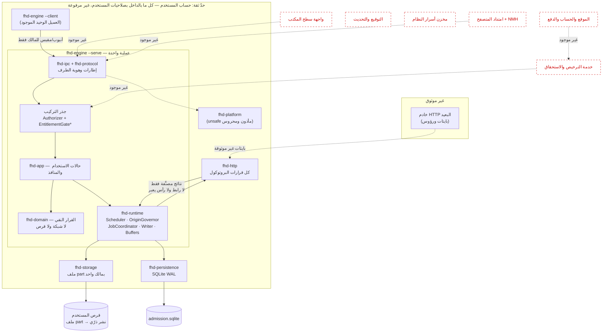

# تقرير حالة المشروع — 2026-09-23

**الجمهور:** مالك المنتج، ومن يراجع القرارات التجارية والهندسية. لا يفترض معرفة بالكود.

**المرجع:** لقطة الكود `ba695ec` على `fix/pipe-owner-identity`، و`2c40799` على `main`. كل رقم هنا مقيَّد بمعرّف commit أو مسار ملف. ما لا دليل عليه مكتوب بوصفه «غير محقَّق»، لا بوصفه ناقصًا فحسب.

**لم يتغير أثناء إعداد التقرير:** لا هدف أداء، ولا ضمان سلامة بيانات، ولا شرط قبول.

**وسم الأدلة:** رقم بلا وسم مأخوذ من اللقطة المرجعية. الأرقام المأخوذة من فرع غير مدموج موسومة بفرعها، لأن قارئًا يفتح المستودع عند اللقطة **لن يجدها**. راجعت الهندسة هذا التقرير فوجدت أني طبّقت تصنيف §0 على الكود ولم أطبّقه على أدلتي أنا — وهذا الوسم هو التصحيح.

---

## 0. كيف يُقرأ هذا التقرير

ثلاثة مستويات لا تُخلط، ولكل بند مستوى واحد:

| المستوى | المعنى | ما لا يعنيه |
| --- | --- | --- |
| **منفَّذ ومختبَر** | كود موجود، واختبارات تُشغَّل في CI على ثلاث منصات وتفشل إن كُسر السلوك | لا يعني تأهيلًا للإطلاق ولا اختبار حمل ولا تدقيقًا خارجيًا |
| **منفَّذ بتحقق ناقص** | كود موجود، لكن الاختبار لا يغطي المسار الحقيقي أو لم يُشغَّل على بيئة حقيقية | **هذا أخطر من غير المنفَّذ**، لأنه يبدو جاهزًا |
| **وثائق فقط** | تصميم مكتوب ولا كود له | ليس عيبًا في ذاته؛ العيب أن يُقرأ كإنجاز |

---

# ١. ما الذي أُنجز؟

## ١.١ الخلاصة

**منتَج داخلي هندسي، لا منتج عملاء.** يوجد محرك تنزيل يعمل فعلًا من سطر الأوامر: ينزّل بالتوازي، يستأنف بعد التعطل، **يتأكد أن البايتات المنشورة هي التي سجّلها هو**، وينشر الملف دون استبدال. (ولا يقارنها ببصمة خارجية إلا إن زوّده المتصل بواحدة — انظر و٥.) ولا يوجد أي شيء آخر يحتاجه عميل: **لا واجهة، ولا امتداد متصفح، ولا موقع، ولا حساب، ولا دفع، ولا ترخيص، ولا توقيع، ولا تحديث.**

عدد الاختبارات ليس مقياس جاهزية، لكنه مقياس تغطية: **326 اختبارًا** في المستودع (156 `#[test]` و170 `#[tokio::test]`)، منها **~191 للمحرك الجديد** و**~135 للمحرك القديم**. سبعة منها `#[ignore]`: ستة أدوات قياس، وواحد حمل اختياري.

والمستودع كله **168 ملفًا متتبعًا**، منها **56 في `docs/`** و20 ملف `Cargo.toml` (19 حزمة + الجذر). نسبة الوثائق إلى الكود تقول وحدها أين يقف المشروع.

**والمحرك نفسه ليس مكتملًا وظيفيًا:** ينقصه الوكيل وPAC وSOCKS5 (PR-003)، وSHA-512 (PR-006)، **وحدود السرعة كليًا** — وكلها موجودة أو مطلوبة في المحرك القديم. انظر ب٢.

## ١.٢ منفَّذ ومختبَر

| المجال | ما يفعله | الدليل |
| --- | --- | --- |
| **قواعد المجال** | آلة حالات المهمة، خريطة المقاطع، سياسة الاستئناف، سياسة إعادة المحاولة — نقية بلا شبكة ولا قرص | `crates/domain` — 29 اختبارًا |
| **النقل** | HTTP بالنطاقات، المدققات (ETag/Last-Modified)، `If-Range`، حدود 206، التحويلات المقيدة، نطاق الاعتماد | `crates/adapters/http` — 13 اختبارًا |
| **التخزين والمتانة** | ملف واحد بمالك واحد، كتابة موضعية، `sync` ثم بصمة لكل نطاق، تحقق نهائي، نشر ذرّي بلا استبدال (`hard_link`) | `crates/adapters/storage` — 15 اختبارًا |
| **الاستمرارية** | SQLite WAL، قبول متين بإيصالات لمنع التكرار، نطاقات متينة، نوايا نشر ومصالحة، مخطط بترحيلات مجموع تحققها مثبت | `crates/adapters/persistence` — 26 اختبارًا، منها اختبار قتل عملية |
| **التشغيل** | منسّق المهمة (قرار ← تثبيت ← تطبيق)، مجدول بثلاثة سقوف، حاكم الأصل (حد اتصالات لكل أصل، `Retry-After` كأرضية)، مسار كاتب واحد، بركة مخازن | `crates/runtime` — 50 اختبارًا |
| **سطح التحكم (IPC)** | بروتوكول بطول مسبوق وJSON مُصدَّر، مقبس Unix في مجلد 0700 مع `SO_PEERCRED`، وأنبوب Windows باسم يحمل SID والجلسة ووصف أمان محمي للمالك وعلامة نزاهة إلزامية، وتحقق العميل من الوصف كاملًا | `crates/protocol` (11)، `crates/adapters/ipc` (5)، `crates/adapters/platform` (7) |
| **بوابة المعمارية** | أداة ترفض أي اعتماد يخالف الاتجاه السداسي، **وتفشل أيضًا إن وُجدت حزمة لا تسمّيها خطوة اختبار** | `tools/check-architecture.mjs` — تمر على 19 حزمة |
| **CI** | ثلاث منصات (Windows / Ubuntu / macOS)، 27 خطوة، خطوة لكل مجال، وخطوات منفصلة لكل اختبار أمني حسّاس، والأفعال مثبتة بـSHA | `.github/workflows/engine.yml` |

**وثغرة في هذا الجدول يجب ألا تُبتلع:** CI **لا يبني ولا يشغّل `fhd-engine` كبرنامج قط**. الخطوة 21 تشغّل `cargo test -p fhd-daemon` فقط، و`cargo build --bin` الوحيد هو للمحرك **القديم** `fhd-transfer`، واختبارا Node التكامليان (25 و26) يقودان `fhd-transfer` لا `fhd-engine`. أي أن **الاختبار التكاملي الحقيقي على برنامج فعلي يجري على المحرك القديم وحده**. تفصيلها في §٦.

**وأهم خبر في هذا القسم:** `main` كان **أحمر على الويندوز** منذ نزول فحص واصف الأنبوب. فرع `fix/pipe-owner-identity` (المرفوع، [PR #2](https://github.com/FMalki1406/FHD/pull/2)) **أخضر على المنصات الثلاث** — أول تشغيل ويندوز ناجح منذ ذلك الحين. التفصيل في §٦.

## ١.٣ منفَّذ بتحقق ناقص

هذه هي الفئة التي تستحق انتباهك.

| البند | ما المنفَّذ | ما الناقص في التحقق |
| --- | --- | --- |
| **تعافي الأقران عبر المنسّق** | استعادة النطاقات المتينة بعد التعطل عبر `coordinator.rs` | **أثبتت مراجعة الهندسة بالطفرة** أن كسر قاعدة «أعد التجزئة بخوارزمية الإيصال» يمر و**كل اختبارات runtime الـ39 خضراء**؛ الاختبار الحقيقي موجود على مستوى محوّل التخزين فقط |
| **ترحيل قاعدة البيانات** | ترحيل `005` يضيف وسم الخوارزمية بقيمة افتراضية | لا اختبار يفتح قاعدة v4 فيها أسطر ويرحّلها فعلًا؛ الاختبار الحالي يعمل على مخطط v5 |
| **ضوابط Windows للأنبوب** | DACL وعلامة النزاهة وتحقق العميل | **الحجز من حساب آخر، والفتح من sandbox، لم يُختبرا** — يلزمهما حساب ثانٍ |
| **مصفوفة التخزين §10.2** | كتابة ومزامنة ونشر | لا اختبار انقطاع طاقة، ولا أقراص شبكة، ولا FAT/exFAT، ولا مضاد فيروسات |
| **أهداف الأداء §1** | قيست محليًا | **استرجاع محلي بلا TLS وبلا شبكة حقيقية** — ليس تأهيلًا. وميزانية المعالج **لم تجتز**: 6.9 مقابل ≈1.07 (§٦) |
| **المحرك القديم** | ست حزم تعمل، وبرنامج `fhd-transfer` | روجعت في 2026-09-21 ولم تُراجَع بعدها؛ **ليست المسار الذي يُبنى عليه، ومع ذلك هي وحدها ما يُختبر تكامليًا في CI** |

## ١.٤ وثائق فقط — لا كود

فحصت المستودع كله (`crates/` و`tools/` والجذر). **لا يوجد أي ملف** من أنواع الواجهات (`.tsx`, `.jsx`, `.vue`, `.svelte`) ولا `manifest.json` لامتداد متصفح. `package.json` الوحيد هو `fhd-engineering` وسكربتاته تشغّل مختبر HTTP فقط.

| المجال | الوثيقة | الكود |
| --- | --- | --- |
| واجهة سطح المكتب | `docs/file-destinations.md`، §3 من معمارية المحرك | **لا يوجد** |
| امتداد المتصفح والـNMH | `docs/request-compatibility.md` | **لا يوجد** |
| الترخيص ومقاومة العبث | `docs/licensing-and-tamper-resistance.md` | **لا يوجد** |
| التفعيل والتثبيت | `docs/customer-installation-and-activation.md` | **لا يوجد** |
| الموقع والدفع | `docs/web-commerce.md` | **لا يوجد** |
| التوقيع والتحديث | `docs/quality-and-release.md`، DL-022 | **لا يوجد** |
| السياسات المؤسسية (ADMX/MDM) | §14 | **لا يوجد** |
| مخزن أسرار النظام | §16 | **لا يوجد** (يوجد تشفير طابور على Windows في المحرك القديم فقط) |

**استثناء يستحق التوضيح:** يوجد منفذ باسم `EntitlementGate` في `crates/application/src/lib.rs:81` — وقد يُقرأ خطأً كأنه ترخيص. **ليس كذلك.** في البناء المُسلَّم، `LocalOperator` (`crates/bins/daemon/src/lib.rs:88-99`) يطبّق `Authorizer` و`EntitlementGate` معًا، وكلاهما `Ok(())` بلا شرط. الباقي بدائل اختبار (`Allow` / `Deny`).

الموضع نفسه **صحيح هندسيًا** على مساره: يُستدعى في `AddDownload::execute` بعد إعادة تشغيل الإيصال لا قبله، فتغيّرُ استحقاقٍ لا يمنع مصالحة مهمة قُبلت بالفعل.

**لكن الوصلة موجودة على مسار `Add` وحده.** الطلبات الأربعة الأخرى — `List` و`Pause` و`Cancel` و`Shutdown` — تمرّ في `crates/bins/daemon/src/service.rs:507-552` إلى المجدول أو المستودع مباشرةً **بلا أي نداء تخويل**. فالقول «الوصلة جاهزة ولا يبقى إلا استبدال `LocalOperator`» **غير صحيح**: وصول الترخيص (ب٤) يتطلب توصيلًا جديدًا في أربعة مسارات. انظر و٤.

## ١.٥ المرفوع مقابل المحلي

| الفرع | الحالة | CI |
| --- | --- | --- |
| `main` (`2c40799`) | مرفوع | **أحمر على الويندوز** |
| `measure/cpu-attribution` (`a331711`، +2) | مرفوع، [PR #1](https://github.com/FMalki1406/FHD/pull/1) | Linux/macOS أخضر، **ويندوز أحمر (عطل موروث من main)** |
| `fix/pipe-owner-identity` (`ba695ec`، +1) | مرفوع، [PR #2](https://github.com/FMalki1406/FHD/pull/2) | **أخضر ×3** |
| `engine/blake3-checkpoints` (`2445f21`، +3) | **محلي فقط، لم يُرفع** | لم يُشغَّل |

**لم يُدمج شيء.** الفروع الثلاثة كلها أمام `main`.

> **مصدر حالات CI:** قُرئت من واجهة GitHub (`/commits/<sha>/check-runs`) في 2026-09-23، **لا من المستودع** — لا أثر محفوظ فيه لأي تشغيلة. هذا أقوى ادعاء إيجابي في التقرير وعليه يقوم ق١، فمصدره مذكور عمدًا.

## ١.٦ سلامة السجل نفسه — **نتيجة غير متوقعة ومقلقة**

دقّقتُ الوثائق مقابل الكود. النتيجة أن **السجل الرسمي للمشروع ليس موثوقًا اليوم**، وأخطاؤه في الاتجاهين.

**أربعة ادعاءات في `docs/execution-status.md` يكذّبها الكود:**

| السطر | يقول | الحقيقة |
| --- | --- | --- |
| `:222` | لا DACL للمالك، ولا تحقق من المالك في العميل، **و«الـworkspace يمنع `unsafe`» فيتعذر تنفيذهما**، و«قرار مطلوب من المستخدم» | **الثلاثة خاطئة.** الاثنان منفَّذان؛ و**لا توجد قاعدة workspace أصلًا** (لا `[workspace.lints]` في الجذر — كل حزمة تعلن سمتها بنفسها)، فلا مانع يُستثنى منه؛ والقرار اتُّخذ ونُفِّذ قبل أربعة commits |
| `:223` | لا عميل سطر أوامر للخدمة | `--client` موجود ويعمل |
| `:221` | لا قياسات أداء ولا benchmark | `measure.rs` موجود و`engine-measurements.md` ينشر خط أساس كاملًا |
| `:13` | ضوابط Windows غير مكتملة | كُتب في **نفس الـcommit** الذي نفّذها |

**وعشرة تناقضات بين الوثائق**، أخطرها:

1. **وثيقتان تعلنان لقطتين مختلفتين للمرجع** — `execution-status.md:7` تقول `bcbc042`، و`enterprise-implementation-status.md:5` تقول `20f4388`، والأولى تحيل إلى الثانية بوصفها «المرجع الموحد». **وكلتاهما متأخرة عن HEAD.**
2. `launch-plan.md:3` يقول «النقل الشبكي والتخزين لم يُنفذا» — **ويناقض نفسه في السطر 69** من الملف نفسه.
3. `README.md:96-111` ينسب قدرات **المحرك القديم وحده** (تشفير الطابور، 8 اتصالات، حد سرعة حي، تجديد الروابط الموقّعة، النقل مجهول الطول) إلى «المحرك» بلا تمييز، بعد 90 سطرًا من إعلان المحرك الجديد مسارًا. **هذه هي بالضبط الحالة التي تحذّر منها §٤.٤.** (وكنت أدرجت «سياسة الكوكيز» معها خطأً — الاعتماد المحدود بالأصل منفَّذ في المحرك الجديد أيضًا.)
4. `security-and-reliability.md` يصف حدّ ثقة **غير موجود** (صفحة ← إضافة ← Native Host)، ولا يغطي الحدّ القائم فعلًا. متأخر بمعمارية كاملة.
5. `quality-and-release.md:88` يحمل هدف أداء مقترحًا **ولا يشير إلى الوثيقة الوحيدة التي قاست فعلًا**.

**لماذا هذا مهم أكثر مما يبدو:** الخطأ في الاتجاهين — وثائق تدّعي ما ليس موجودًا، ووثائق **تنفي ما هو موجود**. والنوع الثاني يجعلك تدفع ثمن عمل مُنجَز مرتين، أو تؤجل قرارًا اتُّخذ. وأنا نفسي بنيت على `:222` في جلسة سابقة قبل أن أفحص الكود.

**وهذا التدقيق عيّنة لا حصر.** وجدت بعده ادعاءً من الصنف نفسه لم يدخل الجدول: `enterprise-engine-architecture.md:345` يقول إن `SetFileValidData` **ممنوع بفحص CI**. **لا وجود لهذا الفحص** — وضابط يُقال إنه مفروض آليًا وهو غير منفَّذ أخطر من عدّة بنود أعلاه.

**الاستثناء المشرّف:** `docs/engine-measurements.md` هو أدق ملف في المستودع — يفصل المقاس عن المقترح عن المنفَّذ، ويذكر حدود الجهاز، **ويسجّل رسوبًا بدل تحريك الهدف**.

---

# ٢. ما الذي تبقّى؟

## ٢.١ ما يمنع الإطلاق للعملاء

مرتّب باعتمادياته. كل بند هنا **مانع**، لا تحسين.

| # | المانع | يعتمد على | لماذا مانع |
| --- | --- | --- | --- |
| **ب١** | **دمج إصلاح الويندوز** | لا شيء | بدونه لا يخضرّ CI لأي فرع، فلا يمكن الحكم على أي عمل لاحق |
| **ب٢** | **تعادل وظيفي للمحرك الجديد** مع PR-003 (وكيل/PAC/SOCKS5) وPR-006 (SHA-512) وقدرات المحرك القديم (حدود السرعة، تجديد الروابط الموقّعة، تخزين الطابور المؤمَّن) | ب١ | **المحرك الجديد ليس مكتملًا.** بناء واجهة فوق محرك ينقصه الوكيل وحد السرعة يعني بناءها مرتين |
| **ب٣** | **واجهة سطح مكتب** | ب٢ | لا يوجد منتج بلا واجهة. المحرك اليوم أداة سطر أوامر |
| **ب٤** | **تكامل المتصفح (امتداد + NMH)** — **ومعه مرشِّح SSRF شرطًا مسبقًا** | ب٣ | السبب الأول لشراء مدير تنزيل هو التقاط الروابط. ولحظة تصير صفحة الويب هي من يختار الرابط، يصير غياب مرشّح العناوين الخاصة ثغرة حقيقية لا مجالًا غير مفحوص |
| **ب٥** | **التخويل لكل أمر على سطح التحكم** | ب١ | ب٦ لا يكتمل بدونه: اليوم أربعة من ستة طلبات بلا أي فحص (و٢) |
| **ب٦** | **الترخيص والتفعيل والاستحقاق** | ب٣، ب٥ | لا يوجد شيء يُباع بلا هذا |
| **ب٧** | **الموقع والحساب والدفع** | ب٦ | قناة الشراء والاستعادة |
| **ب٨** | **التوقيع والحزم والتحديث** | ب٣ | **قناة تحديث بلا توثيق = تنفيذ كود عن بُعد على كل جهاز عميل** — أعلى هدف قيمةً سيعرضه هذا المنتج. وبرنامج غير موقّع على Windows يُنذر عنه ويُحجب |
| **ب٩** | **فحص آلي لثغرات التبعيات** (`cargo audit`/`deny`) | ب١ | شحن ثنائي يتصل بالشبكة بلا أي فحص إرشادات أمنية بوابة إطلاق، لا فجوة توثيق |
| **ب١٠** | **تأهيل أداء على شبكة حقيقية مع TLS** | ب١ | القياس الحالي استرجاع محلي؛ لا يصلح ادعاءً للعملاء |
| **ب١١** | **توثيق ودعم وخطة حوادث** | ب٧، ب٨ | بيع بلا دعم التزام لا يمكن الوفاء به |

**تقدير صريح: هذه ليست أسابيع.** أربعة منها (ب٣، ب٤، ب٦، ب٧) أنظمة كاملة لم يُكتب منها سطر، **وب٢ يقول إن المحرك نفسه لم يكتمل**.

## ٢.٢ ما يمنع تأهيل Enterprise

فوق ما سبق:

| المانع | الحالة |
| --- | --- |
| السياسات المؤسسية المفروضة (ADMX/MDM) وfail-closed | وثائق فقط (§14) |
| مصادقة Proxy بـ NTLM/Kerberos | **قرار مفتوح** في §22، لم يُلتزم به |
| فحص إبطال الشهادات hard-fail | غائب على Linux، soft-fail في غيره — **قرار منتج مطلوب** |
| حزمة تشخيص منقّحة | وثائق فقط |
| مراجعة أمنية خارجية مستقلة وfuzz وbenchmarks (المرحلة 7) | لم تبدأ |
| اختبار انقطاع الطاقة وأقراص الشبكة | لم يُجرَ |

**موقع المشروع من خطة إعادة البناء (§21)، مقيسًا ببوابات القبول التي تنص عليها الخطة نفسها:**

| المرحلة | البوابة | الحالة |
| --- | --- | --- |
| 0–1 الأساس والدومين | CI أخضر ×3، جداول §5.2 | **مستوفاة** |
| 2 المنصة والتخزين والاستمرارية | مصفوفة §10.2، `kill -9`، سباقات المسارات، المزامنة وAV | `kill -9` ✔، **والبقية لم تُختبر** |
| 3 النقل | النطاق نفسه يشترط **proxy وPAC وTLS وSSRF**، والبوابة تشترط proxy حقيقيًا وrebinding | **غير مستوفاة لا في النطاق ولا في البوابة** — لا وكيل ولا PAC ولا مرشّح SSRF |
| 4 التشغيل | أهداف §1 | منفَّذة، **والبوابة راسبة** (و٦) |
| 5 IPC والعملاء ودورة الحياة | انتحال، AppContainer، رفض الرفع، drain | IPC والبروتوكول موجودان؛ **العملاء والتحديث لا** |
| 6–7 المؤسسي والتصلب | — | **لم تبدآ** |

## ٢.٣ عمل هندسي قريب (غير مانع للإطلاق لكنه مستحق)

1. إغلاق شروط مراجعتَي BLAKE3 (§٧).
2. تفسير ثلاثة أسئلة مفتوحة في القياس: سبب القيم الشاذة، سبب ارتفاع المعالج 36% مع التوازي، والفارق ≈1.9 ثانية-نواة/GiB بين مجموع الطبقات وطور النقل.
3. تجميع معاملات القبول (موافَق عليه مبدئيًا بشروط، لم يُنفَّذ).

---

# ٣. ما الذي ينتظر قرارًا؟

## ٣.١ قرارات تخصّك

### ق١ — دمج PR #2 (إصلاح الويندوز)

- **الخيارات:** دمج الآن / تأجيل للمراجعة.
- **توصيتي: دمج الآن.** هو الوحيد الأخضر ×3، ويفكّ الحجب عن كل شيء آخر، وأثره محصور في دالة مقارنة واحدة مع اختبار يثبت الحالتين.
- **أثر التأجيل:** كل فرع لاحق يبقى غير قابل للحكم، ويتراكم عمل على قاعدة حمراء.
- **يتوقف عليه:** PR #1، وفرع BLAKE3، وأي عمل قادم.

### ق٢ — دمج PR #1 (القياسات)

- **الخيارات:** دمج بعد ق١ / تأجيل.
- **توصيتي: دمج بعد ق١**، لأنه وثائق وأدوات قياس `#[ignore]` فقط، **ولا يمسّ مسار البيانات**. وإبقاؤه خارجًا يُبقي رقمًا خاطئًا (16 و11) في الوثائق المدموجة.
- **أثر التأجيل:** استمرار رقم خاطئ في السجل الرسمي.

### ق٣ — BLAKE3: اعتماد أم تأجيل؟

- **الخيارات:** (أ) إغلاق شروط المراجعتين ثم رفع PR؛ (ب) تأجيل الحزمة كلها؛ (ج) اعتماد ما هو قائم الآن.
- **توصيتي: (أ)، مع إضافة** — ربط هوية النطاق في مدخل البصمة **قبل** الرفع. **وتنبيه على مبرّره:** قدّمتُه سابقًا بوصفه ضابطًا ضد العبث، **وهذا خطأ صحّحته المراجعة الأمنية** (خ١): لا يضيف مقاومة عبث ولا ذرة. مبرّره الصحيح أنه **ضابط اتساق بيانات** يكشف سطرًا نُسب لمهمة أو إزاحة خاطئة بخطأ برمجي أو بنسخة احتياطية غير متطابقة. والسبب في فعله الآن توقيت لا أكثر: رمز الخوارزمية 2 **لم يُشحن**، فالتكلفة سطر؛ وبعد الاعتماد تصير ترحيلًا سادسًا ورمزًا ثالثًا ومسار توافق ثالثًا.
- **(ج) مرفوضة:** كلتا المراجعتين «قبول **بشروط**»، والشروط غير مستوفاة.
- **يتوقف عليه:** خفض ميزانية المعالج 55%.

### ق٤ — بناء BLAKE3: تكرارية أم سرعة؟

- **الخيارات:** (أ) `features = ["pure"]` — Rust خالص، بناء متطابق على كل منصة، وأبطأ قليلًا؛ (ب) إبقاء الأسمبلي مع `BLAKE3_CI=1` وتوثيق اشتراط مترجم C لكل منصة.
- **توصيتي: (أ) ثم إعادة القياس.** الفارق المتوقع ~10% — **تقدير غير مقيس**، وهو نفسه سبب إعادة القياس — والمكسب أن **الثنائي المسلَّم لا يتغير بتغير جهاز البناء** — وهذا شرط في AGENTS.md. لو أثبت القياس فارقًا كبيرًا، ننتقل إلى (ب) بقرار موثَّق.
- **أثر التأجيل:** خطر صامت — بناء على مُشغِّل بلا مترجم C ينتج ثنائيًا أبطأ **دون أن يفشل شيء ودون أن يُخبر أحد**.

### ق٥ — نموذج الترخيص التجاري (DL-020)

- **الخيارات:** اشتراك / رخصة دائمة / مختلط؛ وعدد الأجهزة؛ و**كم من الاستخدام غير المصرَّح به دون اتصال نقبل** (لا «طول المهلة» — انظر §٥.٣).
- **توصيتي: لا أوصي — هذا قرار تجاري لا هندسي.** لكنه **يحجب** DL-021 (خدمة الترخيص) و**يحجب** ب٤ و ب٥.
- **أثر التأجيل:** لا يمكن البدء في أي عمل تجاري. هذا أطول مسار حرج غير مبدوء.

### ق٦ — فحص إبطال الشهادات: soft-fail أم hard-fail؟

- **القرار مسجَّل مفتوحًا في §22، لكنه غير قابل للاتخاذ الآن:** وصفتُ السلوك بأنه «غائب على Linux وsoft-fail في غيره»، **وهذا غير محقَّق**. الطبقة `rustls` مع `rustls-platform-verifier`، **ولم يتحقق أحد** أي مدقِّق يعمل وقت التشغيل، ولا أنه يجري أي فحص إبطال على أي منصة، ولا ماذا يحدث لشهادة مُبطَلة. ويوجد `tools/http-lab/tls.test.mjs` **ولا تشغّله أي خطوة في CI**.
- **توصيتي: قِس أولًا** — fixture بشهادة مُبطَلة لكل منصة — ثم قرّر. القرار على أساس غير محقَّق أسوأ من تأجيله.

## ٣.٢ مسائل أحسمها بنفسي (لا تحتاجك)

- إغلاق ملاحظات المراجعتين الهندسية والأمنية (الاختبارات الناقصة، الوثائق البائتة، سجل التبعيات).
- تفسير القيم الشاذة وارتفاع المعالج مع التوازي.
- شكل `FilePart::hash` وتحسين جودة الكود.
- تفاصيل الترحيل ورموز الأخطاء.
- تنفيذ تجميع معاملات القبول ضمن الشروط المعتمدة سلفًا.

---

# ٤. المعمارية المستخدمة فعليًا

## ٤.١ المخطط: التدفق وحدود الثقة

> المتقطّع الأحمر **غير موجود في المستودع**. `EntitlementGate*` منفذ يُرجع `Ok` دائمًا.
>
> **حدّ الثقة الوحيد هو المستطيل الخارجي: «هذا المستخدم».** كل ما بداخله يعمل بصلاحيات المستخدم نفسها، **فلا حدّ ثقة داخله**: أي عملية تعمل بحساب المستخدم — بما فيها برنامج آخر شغّله هو — تستطيع إدراج مهام وإلغاءها وإيقاف المحرك. هوية الطرف تثبت «نفس المستخدم» ولا تثبت أكثر، ولا يوجد تفويض حسب نوع العميل (`crates/bins/daemon/src/service.rs`).
>
> والحد الثاني الحقيقي هو السهم المتقطّع القادم من الخادم: **بايتاته غير موثوقة**، و`fhd-http` وحده يتعامل معها ولا يُمرّر رابطًا ولا رأسًا عبر حدّ المنفذ.

## ٤.٢ الحدود والمسؤوليات المنفَّذة

| المكوّن | يملك | لا يملك |
| --- | --- | --- |
| **fhd-domain** | آلة الحالات، خريطة المقاطع، الاستئناف، إعادة المحاولة | أي I/O — نقي تمامًا |
| **fhd-app** | حالات الاستخدام وتعريف المنافذ | أي تنفيذ محوّل |
| **fhd-runtime** | المنسّق (قرار←تثبيت←تطبيق)، المجدول، حاكم الأصل، مسار الكاتب | قرارات البروتوكول |
| **fhd-http** | المدققات، `If-Range`، حدود 206، التحويلات، نطاق الاعتماد | **لا يُخرج رابطًا ولا رأسًا عبر حدّ المنفذ** |
| **fhd-storage** | ملف part بمالك واحد، بصمة النطاق، التحقق النهائي، النشر الذرّي | الجدولة |
| **fhd-persistence** | قبول متين، نطاقات، نوايا نشر، ترحيلات بمجموع تحقق | **ليست خزنة أسرار** |
| **fhd-ipc + fhd-protocol** | إطارات، هوية الطرف | **التخويل — يقرره جذر التركيب** |
| **fhd-platform** | SID والجلسة، وصف الأمان، ساعة المعالج | أي سياسة |

**16 من 19 حزمة تعلن `#![forbid(unsafe_code)]`.** والثلاث الباقية تحوي `unsafe` فعليًا — انظر خ٦، فالادعاء بأن `fhd-platform` وحدها تحويه **غير صحيح**.

**حدّ الثقة الوحيد المنفَّذ هو «نفس المستخدم».** هوية الطرف تثبت هذا ولا تثبت أكثر.

## ٤.٣ المنفَّذ مقابل المستهدف

| §  المستهدف | الحالة |
| --- | --- |
| §3 طوبولوجيا العمليات | **جزئي**: العملية والـIPC موجودان؛ الواجهة والـNMH وعامل الوسائط **غير موجودة** |
| §5–§8 الدومين والمنافذ والتطبيق والتشغيل | **منفَّذ** |
| §9–§11 مسار البيانات والتخزين والاستمرارية | **منفَّذ** |
| §12 الشبكة | **جزئي.** المدققات و`If-Range` وحدود 206 والتحويلات المقيدة ونطاق الاعتماد منفَّذة. **والوكيل وPAC وNTLM/Kerberos ومرشِّح SSRF غير موجودة** (`crates/adapters/http/src/lib.rs:171` = `.no_proxy()`) |
| §14 السياسات المؤسسية | **غير موجود** |
| §16 الأمان | **جزئي**: حدود المسارات وهوية الطرف منفَّذة؛ مخزن الأسرار والترخيص **غير موجودين** |
| §19 الميزانيات | **قيست، ولم تُجتز كلها** |

## ٤.٤ المحرك القديم والجديد

**يتعايشان، والقديم ليس مهجورًا ولا هو المسار.**

- **الجديد** (`domain`, `application`, `runtime`, `adapters/*`, `bins/daemon` → `fhd-engine`): المسار المعتمد، معماري سداسي ببوابة اعتماديات آلية.
- **القديم** — ست حزم يعرّفها `tools/check-architecture.mjs:36-45`: `download-engine`, `download-core`, `transfer-store`, `resume-policy`, `queue-secrets`, `platform-files` → برنامج `fhd-transfer`. أداة مطوّر عاملة فيها ميزات لم تُنقل (تشفير الطابور بـDPAPI على Windows). روجعت في 2026-09-21.
- **تداخل واحد مقصود:** `resume-policy` مصنَّفة قديمة **لكنها حيّة في المسار الجديد** — `fhd-domain` يعتمدها ويعيد تصديرها (`crates/domain/src/lib.rs:7`). الأداة توثّقها بأنها «جسر ترحيل مؤقت يُزال حين تنتقل قواعد الاستئناف إلى الدومين».
- **حزمة يتيمة:** `fhd-config` (إعدادات مُتحقَّق منها، 3 اختبارات) **لا تعتمدها أي حزمة ولا يستوردها أي كود**. بوابة المعمارية تسمح باعتمادها ولا أحد يفعل. اختباراتها الثلاثة تُشغَّل في CI وتعطي إشارة تغطية لكود لا يعمل.
- **الخطر:** ميزتان لمنتج واحد بسلوكين. §21 تحدد ما يُنقل وما يُستبدل، **ولم يُحذف القديم ولا نُقلت كل ميزاته**. أي وثيقة تنسب قدرة أحدهما للآخر مضلِّلة.

---

# ٥. الحماية ضد الكراك

## ٥.١ الحالة بصراحة

**لا يوجد أي حماية منفَّذة. ولا سطر واحد.**

| الضابط | المنفَّذ |
| --- | --- |
| التفعيل | **لا شيء** |
| ربط الأجهزة | **لا شيء** |
| تراخيص دون اتصال | **لا شيء** |
| تحقق على الخادم | **لا شيء — لا يوجد خادم أصلًا** |
| توقيع البرنامج | **لا شيء** |
| توقيع التحديثات | **لا شيء — لا قناة تحديث** |
| حماية المفاتيح | **لا شيء — لا مفاتيح** |

ما هو موجود: وثيقة تصميم (`docs/licensing-and-tamper-resistance.md`)، ومنفذ `EntitlementGate` يُرجع `Ok` دائمًا.

## ٥.٢ ماذا يحدث لو عُدِّل العميل اليوم؟

**لا شيء، لأنه لا يوجد ما يُتجاوَز.** البرنامج مجاني وظيفيًا بالكامل.

## ٥.٣ ما الذي سيبقى محميًا على الخادم لاحقًا؟

**اليوم: لا شيء، لعدم وجود خادم.** وحين يوجد، هذه هي الحدود التي لا تتغير بأي كمية هندسة في العميل:

- **ما يمكن حمايته فعلًا:** موارد يملكها الخادم — تنزيل الحزم المرخّصة، تسليم التحديثات الموقّعة، أي خدمة سحابية. الخادم يخوّل الطلب بنفسه ولا يثق بعلامة محلية.
- **ما لا يمكن حمايته:** أي ميزة تعمل كليًا على جهاز المستخدم. عميل معدَّل يُسقط الفحص.
- **الفحوص المحلية تقلّل التجاوز العَرَضي وتجاوز الواجهة، ولا تصمد أمام عميل معدَّل.** هذه ليست عبارة تحفّظ بل الحقيقة الهندسية.
- **لا وعد بمناعة.** والإبطال دون اتصال لا يكون فوريًا: من يعمل دون اتصال لا يعلم بالإبطال حتى يتصل.
- **والتخويل على الخادم يضبط مَن يحصل على نسخة، لا ما يحدث للنسخة بعدها.** حساب واحد مخوَّل يكفي لإعادة توزيع البناء.

### قيدان يجب أن يدخلا قرار ق٥

1. **الساعة بيد المستخدم.** أي «مهلة عمل دون اتصال» مربوطة بساعة يتحكم فيها. إرجاعها يمدّ المهلة بلا حد. والمعالجة المعتادة — علامة تقدّم رتيبة محفوظة في حالة محمية — **يُسقطها العميل المعدَّل نفسه** الذي تعترف هذه الفقرة سلفًا بأنه لا يُقاوَم.
2. **عدد الأجهزة يُفرض على الخادم وقت التفعيل فقط.** لا شيء منه يصمد على عميل يعمل دون اتصال.

لذلك ق٥ ليس «كم طول المهلة؟» بل **«كم من الاستخدام غير المصرَّح به دون اتصال نقبل؟»** — هذا ما يُقرَّر فعلًا.

### ولا توجد اليوم نزاهة ثنائي من أي نوع

§٥.٢ تقول «لا شيء يُتجاوَز» وهي صحيحة **عن الترخيص وحده**. لا تُقرأ «لا يوجد ما يُهاجَم»: لا توقيع ولا تحقق سلامة للثنائي المسلَّم، ولا قناة تحديث موثَّقة.

---

# ٦. نقاط الضعف الحالية

## ٦.١ ثغرات معروفة ومؤكدة

### و١ — رفض الأنبوب لنفسه على حسابات المدير *(أُصلح، ينتظر الدمج)*

- **الأثر:** سطح التحكم (IPC) **لا يعمل إطلاقًا** على أي حساب له اسم SDDL مختصر — حساب المدير المدمج منها.
- **الشرط:** Windows يطبع الـSID المعروف باسمه المختصر (`LA`)، والفحص كان يقارن نصًا.
- **الدليل:** فشل CI على `main`؛ الرسالة `the account does not own it: O:LAG:LAD:P(A;;FA;;;LA)...`.
- **يفشل مغلقًا — لا انكشاف.** لكنه تعطيل كامل.
- **المعالجة:** `ba695ec` يقارن SIDs بـ`EqualSid`. **ومَنَعَ تكرار السبب:** خطوة CI تفشل الآن إن وُجد اختبار لا تسمّيه خطوة.
- **يمنع الإطلاق؟ نعم** (بصيغته الحالية على `main`). أُصلح وينتظر ق١.

### و٢ — لا تخويل لكل أمر على سطح التحكم

- **الأثر:** أي عملية تعمل بحساب المستخدم تستطيع **إيقاف المحرك**، أو **إلغاء أي مهمة** (المعرّفات أعداد صحيحة صغيرة متسلسلة، فتُعدّ)، أو **قراءة قائمة مهامه كلها**. لا يمر شيء من هذا بأي فحص.
- **الشرط:** لا شيء سوى التشغيل بحساب المستخدم — ملف `.exe` نزّله، أو امتداد محرِّر، أو سكربت.
- **الدليل:** `crates/bins/daemon/src/service.rs:507-552` — `Add` وحده يمر بـ`AddDownload`؛ و`Shutdown` يُنفَّذ بلا شرط.
- **المعالجة:** منفذ تخويل على كل أمر، لا على `Add` وحده.
- **يمنع الإطلاق؟ نعم بالتبعية** — ب٤ لا يكتمل بدونه.

### و٣ — مجلد الحالة بلا أذونات على Windows

- **الأثر:** الجانب الساكن من حدّ «نفس المستخدم» **غير مفروض على Windows**. المجلد يحوي قاعدة المهام والإيصالات وكل الملفات الجزئية، ويرث ما يرثه من المسار الذي يمرّره المشغِّل.
- **الدليل:** `crates/bins/daemon/src/lib.rs:200-224` — ضبط `0o700` تحت `#[cfg(unix)]` **فقط**؛ وعلى Windows يُرفض إعادة التوجيه ولا شيء غير ذلك.
- **وهذا يغيّر فرضية خ١:** «مهاجم يكتب `admission.sqlite`» ليس افتراضًا نظريًا إن كان المجلد قابلًا للكتابة من غير المالك.
- **المعالجة:** ACL صريح على Windows، أو على الأقل رفض مجلد يمنح كتابة لغير المالك.
- **يمنع الإطلاق؟ نعم.**

### و٤ — التحقق النهائي اختياري في المسار الافتراضي

- **الأثر:** الملف يُنشر **بلا أي تحقق نزاهة من طرف إلى طرف** ما لم يزوّد المتصل ببصمة متوقَّعة. ما يجري افتراضيًا هو أن المحرك يقارن بايتات كتبها هو ببصمة حسبها هو — وهذا يكشف تلف القرص، لا خادمًا أرسل غير ما وعد.
- **الدليل:** `crates/adapters/storage/src/lib.rs:478-479` (`if expected.is_some_and(...)`)، و`expected_sha256` اختياري في `crates/protocol/src/lib.rs:82-83`.
- **ليس عيبًا في التنفيذ** — لا مصدر للبصمة إن لم يعطها أحد. لكنه **حدّ يجب ألا يُقرأ كضمان**.

### و٥ — أعطال TLS تُصنَّف بمطابقة نصية

- **الأثر:** `connection_error` يصنّف الأعطال بالبحث عن `"certificate"` و`"tls"` و`"handshake"` في نص الخطأ. تغيّر صياغة رسالة في `reqwest`/`rustls` يحوّل **شهادة مرفوضة** من قرار يتطلب إنسانًا إلى **خطأ عابر يُعاد عليه** — بصمت.
- **الدليل:** `crates/adapters/http/src/lib.rs:275-297`.
- **يمنع الإطلاق؟ يجب أن يُصلَح قبله** — هذا عطل في سلامة قرار أمني، لا في جودة كود.

### و٦ — ميزانية المعالج لم تُجتز

- **الأثر:** استهلاك معالج أعلى من الهدف بـ **6.4×** (6.9 مقابل ≈1.07 ثانية-نواة/GiB).
- **الدليل:** `a331711:docs/engine-measurements.md` §3–§4، سبع تشغيلات لكل إعداد — **على فرع `measure/cpu-attribution` غير المدموج**.
- **وما يقوله السجل المدموج اليوم مختلف:** عند اللقطة المرجعية و`main` يسجّل الملف **16 ثانية-نواة/GiB و«لم يجتز — 15×»** و«ثلاث تشغيلات»، ويحتفظ بـ11 رقمًا تشخيصيًا. الرقمان 16 و11 **خاطئان**: الأول يخلط التحقق النهائي المستثنى بالمحسوب، والثاني لم يُقَس أصلًا. **ويبقى هذا هو السجل الرسمي حتى يُتخذ ق٢.**
- **السبب مفكَّك جزئيًا:** استقبال HTTP وحده 1.4 — **أكثر من الميزانية كلها**؛ وتجزئة نقاط التفتيش 3.6.
- **المعالجة:** BLAKE3 يخفضه إلى 3.1 — **قيس محليًا على `2445f21`، وهو فرع لم يُرفع ولم يُشغَّل عليه CI**. وهو **ما زال 2.9× فوق الهدف**.
- **يمنع الإطلاق؟ ليس بذاته** — يمنع ادعاء أداء، ويؤثر في عمر البطارية.

### و٧ — تغطية اختبار زائفة في مسار التعافي

- **الأثر:** كسر قاعدة «أعد التجزئة بخوارزمية الإيصال» **لا يُكتشف**، وكل اختبارات runtime خضراء.
- **الدليل:** [مراجعتا BLAKE3](blake3-checkpoint-reviews.md)، **بالطفرة**: تعديل `engine/blake3-checkpoints:crates/adapters/storage/src/lib.rs:488` إلى `CURRENT` ← 22 اختبار منسّق و8 كاتب و9 مجدول **كلها نجحت**. (السطر نفسه عند اللقطة المرجعية شيء آخر تمامًا — الملف لم يتغير بعد.) **وتشغيل الطفرة نفسه لا أثر محفوظ له في المستودع**؛ هو منقول عن تقرير المراجع.
- **الشرط:** يصبح خطرًا فعليًا عند اعتماد BLAKE3 — حينها انحدار صامت يُفقد كل تنزيل قديم.
- **يمنع الإطلاق؟ يمنع اعتماد BLAKE3.** شرط في ق٣.

### و٨ — الترحيل غير مختبَر على المسار الحقيقي

- **الأثر:** ادعاء «التنزيلات القديمة تستأنف» يستند إلى قراءة الـDDL لا إلى اختبار.
- **الدليل:** كلتا المراجعتين على تغيير BLAKE3. الاختبار الحالي يعمل على مخطط v5.
- **يمنع الإطلاق؟ يمنع اعتماد BLAKE3.**

## ٦.٢ مخاطر محتملة غير مؤكدة

### خ١ — البصمة لا تُلزِم هوية النطاق *(عيب اتساق بيانات، لا مقاومة عبث)*

> **تصحيح:** وصفتُ هذا في مسودة سابقة بأنه «الأخطر في القائمة» وضابط ضد العبث. **كلاهما خطأ**، صحّحته المراجعة الأمنية على التقرير، وأسجّله هنا لأن الخطأ كاد يجعلني أطلب موافقتك على شرط إلزامي بحجة حماية لن توجد.

- **ما الخطأ في الوصف السابق:** قلت إن المهاجم يحتاج منطقة «بايتاتها متطابقة صدفةً». لا يحتاج. `start` و`end_excl` و`digest` **أعمدة في السطر نفسه** (`crates/adapters/persistence/src/transfer.rs:147-165`)، فمن يكتب القاعدة يكتب الثلاثة: يضع النطاق حيث شاء، ويضع البصمة = تجزئة ما هو موجود هناك فعلًا.
- **ولماذا المعالجة لا تحمي:** SHA-256 وBLAKE3 **غير مفتاحيتين**، وكل مدخل مقترح (`label`, `job`, `generation`, `start`, `end`) معلوم للمهاجم. فيحسب البصمة المربوطة بالسهولة نفسها. **ربط الهوية لا يضيف مقاومة عبث ولا ذرة.**
- **والحد الصريح كان مُساء التحديد:** قلت «من يكتب في الاثنين يتجاوزه». الصحيح: **الكتابة في القاعدة وحدها تكفي**.
- **ما قيمته الحقيقية إذن:** يكشف سطرًا نُسب لمهمة أو جيل أو إزاحة خاطئة **بسبب خطأ برمجي، أو كتابة جزئية، أو قاعدة استُعيدت من نسخة احتياطية لا تطابق ملف الـpart**. هذا عيب اتساق يستحق الإصلاح، وما زال بكلفة سطر ما دام الرمز 2 لم يُشحن.
- **والحقيقة التي يجب أن تُقال صراحةً:** **لا يوجد — ولا يمكن أن يوجد — ضابط نزاهة هنا في مواجهة مهاجم يعمل بحساب المستخدم نفسه**، ضمن الحدّ القائم. من يكتب القاعدة يملك المحرك.
- **يمنع الإطلاق؟ لا.**

### خ٢ — بناء غير قابل للتكرار

- **الأثر المحتمل:** ثنائي أبطأ بصمت على جهاز بناء بلا مترجم C، ومكسب 55% لا يتحقق **دون أن يفشل شيء**.
- **الدليل:** مراجعة الأمن رقم 3 — تُوُثِّق إخراج `blake3_avx512_assembly.lib` فعليًا.
- **المعالجة:** ق٤.

### خ٣ — قائمة منع بدل قائمة سماح في فحص الوصف

- **الأثر المحتمل:** وصف يمنح وصولًا كاملًا لمستخدم محلي **بعينه** ليس في قائمة المنع.
- **وأضعف مما وصفتُ:** الفحص **لا يتحقق إطلاقًا** من أن مستفيد الإذن هو نحن؛ يرفض ثمانية رموز فقط. و**وصف بقائمة تحكم فارغة (NULL DACL) يُقبل** لأنه لا يطابق شيئًا في قائمة المنع. والقائمة تشمل الاسمين `AU`/`IU` ولا تشمل SIDيهما الحرفيين، بينما تشمل الحرفيين لغيرهما — تناقض.
- **والاختبار الذي أضفته في `ba695ec` يثبّت التساهل كسلوك صحيح**: يؤكّد قبول وصف يمنح وصولًا كاملًا لحساب آخر. فالتحويل إلى قائمة سماح صار تغيير اختبار أيضًا.
- **الشرط:** بلوغه يتطلب سبق المحرك إلى اسم الأنبوب (`FIRST_PIPE_INSTANCE`)، وخصمًا عند نزاهة متوسطة **داخل الحساب نفسه** — أي داخل الحدّ أصلًا. **العلامة الإلزامية هي الضابط الذي يعمل فعلًا هنا.**
- **أولوية منخفضة** — نظافة كود، لا ثغرة. أعلى منها بكثير: SSRF (ب٣).
- **المعالجة:** تحويله إلى قائمة سماح.

### خ٤ — `unsafe` خارج الحزمة المخصصة له، بلا حارس

- **الأثر المحتمل:** §4 من المعمارية تنص أن `fhd-platform` هي **الوحيدة** المسموح فيها `unsafe`. **هذا غير صحيح.** ثلاث حزم تحوي `unsafe` فعليًا:
  - `crates/adapters/platform` — 27 موضعًا، محروسة بـ`cfg_attr(not(windows), forbid)` و`deny(unsafe_op_in_unsafe_fn)`.
  - `crates/queue-secrets/src/lib.rs:52,67,100` — DPAPI و`slice::from_raw_parts` على مخرجات `CryptUnprotectData`. تحمل `deny(unsafe_op_in_unsafe_fn)` ولا تحمل `forbid`.
  - `crates/platform-files/src/lib.rs:14,36,40` — `GetDiskFreeSpaceExW` و`statvfs`. **بلا أي سمة حراسة** — الوحيدة في المستودع كذلك.
- **و`fhd-platform` نفسها إعلانها مشروط**: `cfg_attr(not(windows), forbid(unsafe_code))` — أي **لا شيء يمنع `unsafe` فيها على Windows**، وهي المنصة التي تعنينا.
- **تصحيح لترتيبي:** خصصتُ `platform-files` بالذكر لأنها «تقرأ من مؤشر نظام»، **وهي لا تفعل** — الاستدعاءان يكتبان في معاملات خرج يملكها المتصل، وهي أسلم الثلاث. والحزمة التي تحلّل بيانات قابلة لتأثير المهاجم هي `queue-secrets`. **وقد فُحص ذلك البلوك في المراجعة الأمنية: لا عيب سلامة فيه** — الطول والمؤشر مُتحقَّق منهما، والمخزن يُمسح ويُحرَّر في `Drop` شاملًا مسارات الخطأ.
- **الدليل:** جرد الكود. وبوابة المعمارية **لا تفحص هذا** — تفحص الاعتماديات لا السمات.
- **المعالجة الوحيدة ذات الأثر:** توسيع البوابة لتفشل إن وُجدت `unsafe` في حزمة غير مُدرجة، **وتصحيح §4 من المعمارية** لأن ادعاءها الحالي غير صحيح.
- **يمنع الإطلاق؟ لا.** لكنه يُبطل ادعاءً أمنيًا قائمًا في الوثائق.

### خ٥ — المحرك الجديد لا يُختبر كبرنامج في CI *(واقعة مؤكَّدة، لا خطر محتمل)*

> مكانها الصحيح §٦.١؛ تُركت هنا لئلا تُعاد ترقيمات البنود، **وتُقرأ بوصفها مؤكَّدة**.

- **الأثر:** عطل في تجميع الأجزاء أو في سطر الأوامر أو في التشغيل الفعلي **لا يظهر في CI**. اختبارات `fhd-daemon` تختبر المكتبة؛ والاختباران التكامليان اللذان يشغّلان برنامجًا حقيقيًا يقودان `fhd-transfer` **القديم**.
- **الشرط:** أي انحدار في `main.rs` أو في تركيب الخدمة.
- **الدليل:** `.github/workflows/engine.yml` — `cargo build --bin` الوحيد لـ`fhd-transfer`؛ والخطوتان 25 و26 تشغّلان سكربتين يقرآن `FHD_TRANSFER_BIN` إن ضُبط **ويقعان افتراضيًا على `target/debug/fhd-transfer`**.
- **المعالجة:** بناء `fhd-engine` وتشغيل اختبار تكاملي عليه.
- **يمنع الإطلاق؟ نعم بالتبعية** — لا يصح شحن برنامج لا يبنيه CI.

### خ٦ — حزمة ميتة تعطي إشارة تغطية زائفة

- **الأثر:** `fhd-config` (إعدادات مُتحقَّق منها، وكيل، تنقيح كلمات المرور) **لا يستوردها أحد**. اختباراتها الثلاثة تُشغَّل في CI فتبدو كتغطية لكود عامل.
- **وأثر أعمق:** `fhd-http` يبني عميله بـ`.no_proxy()` — أي أن **دعم الوكيل مكتوب وغير موصول**. وهذا بند في متطلبات المنتج (PR-003).
- **المعالجة:** وصلها أو حذفها؛ وأيًّا كان، لا تُحتسب تغطيةً.

### خ٧ — خطأ دائم يُقرأ كخطأ عابر

- **الأثر:** إيصال تالف دائمًا يُعاد المحاولة عليه مرتين بانتظار، ثم يظهر كعطل عابر لا كسبب قابل للتصرف.
- **الدليل:** مراجعة الهندسة 6 و7.

### خ٨ — سطر تالف واحد يمنع إقلاع المحرك كله

- **الأثر:** خوارزمية مجهولة في سطر واحد تُفشل `load_jobs`، فلا تُحمَّل **أي** مهمة.
- **ليس انحدارًا** — كل عمود تالف يسلك هذا المسلك.

## ٦.٣ ما لم يُفحص إطلاقًا

**هذه الفئة أكبر من الفئتين قبلها، ويجب ألا تُقرأ كقائمة قصيرة.**

| المجال | الحالة |
| --- | --- |
| الترخيص والتفعيل والدفع | **لا كود فلا فحص** |
| الواجهة وامتداد المتصفح والـNMH | **لا كود فلا فحص** |
| التوقيع والتحديث | **لا كود فلا فحص** |
| الحجز من حساب آخر، والفتح من sandbox | **لم يُختبرا** — يلزمهما حساب ثانٍ |
| مكافئ عزل الصندوق الرملي على Linux (Flatpak) | **لا يوجد** |
| انقطاع الطاقة، أقراص الشبكة، FAT/exFAT، مضاد الفيروسات | **لم تُختبر** |
| Proxy حقيقي، PAC، DNS rebinding | **لم تُختبر**؛ والـrebinding مكشوف: كل طلب يحلّ الاسم من جديد ولا شيء يثبّت العنوان المحلول |
| fuzz وbenchmarks ومراجعة خارجية | **لم تبدأ** |
| **فحص آلي لثغرات التبعيات** (`cargo audit`/`deny`) | **غير موجود إطلاقًا** — صار ب٩، لا سطرًا هنا |
| جرد تراخيص وNOTICE | **غير موجود**، **ولا ملف `LICENSE` في المستودع أصلًا** — والتزام Apache-2.0 §4(d) عند الإطلاق يفترض اختيار رخصة لا يسجّله المستودع |
| المحرك القديم منذ 2026-09-21 | **لم يُراجَع بعدها** |
| ~~مرشِّح SSRF~~ | **نُقل إلى ب٤ شرطًا مسبقًا.** ليس «مجالًا لم يُفحص» بل **ضابط محدَّد في `security-and-reliability.md` بلا كود**: `parse_url` يفحص المخطط والمضيف والطول، **ولا يرشّح loopback ولا العناوين الخاصة ولا `169.254.169.254`**. خطورته اليوم منخفضة لأن المستخدم يسمّي رابطه بنفسه، **وتصير عالية لحظة نزول ب٤** |
| عزل عامل الوسائط، وعلامة الويب (MOTW) | **لا يوجد كود** |
| SHA-512 (مطلوب في PR-006) | **غير منفَّذ** — SHA-256 فقط |
| حدود السرعة في المحرك الجديد | **غير موجودة إطلاقًا** (موجودة في القديم وحده) |

---

# ٧. المراجعات المستقلة

## ٧.أ على تغيير BLAKE3

**مسجَّلة كاملةً في [`docs/blake3-checkpoint-reviews.md`](blake3-checkpoint-reviews.md)** — كُتبت بعد أن نبّهت مراجعةُ الهندسة على هذا التقرير إلى أن §٧ كانت تستشهد بأدلة لا يستطيع القارئ فتحها. كلتاهما على `2445f21`، ومستقلتان عن المنفِّذ، وبنت كلٌّ منهما في worktree منفصل.

| | الهندسة | الأمن |
| --- | --- | --- |
| **الحكم** | قبول بشروط | قبول بشروط |
| **الشروط** | اختبار المزج على مستوى المنسّق؛ اختبار ترحيل v4→v5 حقيقي؛ تصحيح وثيقتين | تصحيح وثيقتين؛ تسجيل التبعية وترخيصها؛ إصلاح تكرارية البناء؛ **وربط هوية النطاق في البصمة (يُنصح الآن بشدة)** |

### ما اتفقتا عليه

- **التصميم سليم في جوهره**: الوسم لكل إيصال، وإعادة التجزئة بخوارزمية الإيصال، **وعقد الملف المنشور لم يُمَس** (تحققت الأمن من كل موضع بصمة على حدة).
- **وثيقتان بائتتان** (`enterprise-storage.md:13`، `enterprise-persistence.md:46`) — **مانع عند كلتيهما**.
- **اختبار الترحيل بديل لا أصل.**
- **بناء الدالتين معًا في كل نداء** هدر شكلي.
- **نظافة `PRAGMA` في الاختبار.**

### اختلافهما — مسجَّل كما هو

| الموضوع | الهندسة | الأمن | حسمي |
| --- | --- | --- | --- |
| **تغطية مسار المنسّق** | **مانع**، وأثبتته بالطفرة | لم تُثرها؛ اعتبرت المزج مُثبتًا باختبار محوّل التخزين | **الهندسة محقة**: الدليل تجريبي؛ اختبار المحوّل لا يغطي المنسّق |
| **ربط الهوية في البصمة** | لم تُثرها | **يُنصح به الآن بشدة**، بسيناريو فشل دقيق | **الأمن محقة**: هندسيًا غير مرئي، أمنيًا جوهري |
| **تكرارية البناء** | «ملاحظة للاكتمال» | **مانع** | **الأمن محقة**: AGENTS.md ينص على مدخلات بناء قابلة للتكرار |
| **كلفة بناء الدالتين** | قِستها: ~1.9KB مرة لكل نداء، غير مرئية | «غير ضارة لكن بلا معنى» | متفقتان عمليًا؛ **الهندسة أدق** لأنها قاست |

**النمط:** كل مراجعة وجدت ما لم ترَه الأخرى. لو اكتفيت بواحدة لفاتني إما و٧ أو خ١.

**وتصحيح لاحق:** توصية «ربط هوية النطاق» صحيحة، **ومبرّرها الأمني الذي قُدِّم بها خاطئ** — لا تضيف مقاومة عبث (خ١). كشفته المراجعة الأمنية على هذا التقرير، لا مراجعة التغيير.

## ٧.ب على هذا التقرير نفسه

راجعت وكيلا Engineering وSecurity **التقرير** لا الكود، وكلاهما **قبول بشروط**، وقد طُبِّقت الشروط قبل التسليم.

**ما وجدته الهندسة:** أخطر ملاحظاتها أني **طبّقت تصنيف §0 على الكود ولم أطبّقه على أدلتي أنا** — أرقام من فروع غير مدموجة (بل من فرع لم يُرفع) معروضة بثقة السجل المدموج، ومراجعتان بلا أثر في المستودع. وصحّحت أيضًا: عدد ملفات `docs/` (56 لا 50)، ووصف §12 بأنه منفَّذ وهو جزئي، وادعاء «المراحل 0–4 منفَّذة» والمرحلة 3 غير مستوفاة نطاقًا ولا بوابةً، **وغياب تعادل المحرك الجديد من قائمة الموانع** — وهو أكبر نقص اكتمال في التقرير.

**ما وجدته الأمن:** أن **نموذج التهديد في خ١ مقلوب** والمعالجة المقترحة لا تحمي، وأن أربعة من ستة طلبات بلا تخويل (و٢)، وأن مجلد الحالة بلا أذونات على Windows (و٣)، وأن التحقق النهائي اختياري (و٤)، وأن أعطال TLS تُصنَّف بمطابقة نصية (و٥)، وأن SSRF ضابط مصمَّم غير منفَّذ لا «مجال لم يُفحص».

### اختلافهما على هذا التقرير

| الموضوع | الهندسة | الأمن |
| --- | --- | --- |
| خ١ | لم تُثرها | **الأخطر**: الوصف والمعالجة كلاهما خطأ |
| وسم الفروع على الأرقام | **مانع** | لم تُثرها |
| خ٣ (قائمة المنع) | لم تُثرها | **أضعف مما وُصف، وأولويته أقل مما أعطيته** |
| تعادل المحرك الجديد | **مانع** | لم تُثرها |

**النمط نفسه تكرر:** كل مراجعة وجدت ما لم ترَه الأخرى. والهندسة لخّصته بجملة أحتفظ بها: «التقرير أمين عن المشروع وأقل أمانة عن نفسه».

---

# ٨. أهم خمس خطوات تالية

| # | الخطوة | لماذا الآن | يحتاجك؟ |
| --- | --- | --- | --- |
| **١** | **دمج PR #2** ثم PR #1 | يفكّ الحجب عن كل شيء؛ لا يمكن الحكم على أي عمل فوق قاعدة حمراء. **ودمج PR #1 يُخرج الرقمين الخاطئين 16 و11 من السجل الرسمي** | **نعم — ق١، ق٢** |
| **٢** | **إغلاق العيوب الأمنية المؤكَّدة الأربعة**: التخويل لكل أمر (و٢)، أذونات مجلد الحالة على Windows (و٣)، تصنيف أعطال TLS بلا مطابقة نصية (و٥)، وتشغيل `test:tls` في CI | هذه **مؤكَّدة لا محتملة**، وثلاثة منها بكلفة صغيرة، و و٢ يحجب الترخيص كله | لا |
| **٣** | **البتّ في نموذج الترخيص (DL-020)** | أطول مسار حرج **لم يبدأ**، ويحجب الترخيص والموقع والدفع | **نعم — ق٥** |
| **٤** | إغلاق شروط مراجعتَي BLAKE3: اختبار المنسّق، اختبار v4→v5 حقيقي، ربط هوية النطاق، الوثيقتان البائتتان، سجل التبعية وترخيصها، تكرارية البناء | و٧ و و٨ تُغلقان الآن بكلفة صغيرة، وبعد الشحن بترحيل كامل | **ق٣، ق٤** |
| **٥** | **تصحيح السجل**: الادعاءات الأربعة الخاطئة، وادعاء فحص CI غير الموجود، وتوحيد لقطة المرجع، وتمييز قدرات المحرك القديم في `README`، وتصحيح §4 عن `unsafe` | سجل يكذّب نفسه أسوأ من سجل ناقص، ويُكلّف عملًا مكررًا وقرارات مؤجَّلة بلا سبب | لا |

**وأُسقطت عمدًا** رغم استحقاقها: تأهيل الأداء على شبكة حقيقية، وتفسير الأسئلة الثلاثة المفتوحة في القياس، وتجميع معاملات القبول، وتعادل المحرك الجديد (ب٢). الأخير **الأكبر حجمًا**، لكنه يبدأ بعد أن تصير القاعدة خضراء وتُغلق العيوب المؤكَّدة.

---

# ٩. القرارات المطلوبة منك الآن

| # | القرار | توصيتي |
| --- | --- | --- |
| **ق١** | دمج PR #2 (إصلاح الويندوز)؟ | **نعم، الآن.** الوحيد الأخضر ×3، ويفكّ الحجب عن كل شيء |
| **ق٢** | دمج PR #1 (القياسات) بعده؟ | **نعم.** وثائق وأدوات `#[ignore]` فقط، ويُخرج رقمين خاطئين من السجل |
| **ق٣** | إغلاق شروط BLAKE3 مع ربط هوية النطاق قبل الرفع؟ | **نعم** — مع العلم أن مبرّر الربط **اتساق بيانات لا مقاومة عبث** |
| **ق٤** | `pure` للتكرارية ثم إعادة القياس؟ | **نعم.** ثنائي لا يتغير بتغير جهاز البناء يستحق ~10% تقديرًا |
| **ق٥** | نموذج الترخيص: اشتراك/دائم/مختلط، وعدد الأجهزة، **وكم من الاستخدام غير المصرَّح به دون اتصال نقبل** | **لا توصية — قرار تجاري.** لكنه **أطول مسار حرج غير مبدوء** |
| **ق٦** | إبطال الشهادات: soft-fail أم hard-fail؟ | **قِس أولًا.** وصفي السابق للسلوك غير محقَّق، فالقرار غير قابل للاتخاذ الآن |

الباقي أُنجزه بلا استئذان.

---

# ملحق: ما صُحِّح في هذا التقرير بعد مراجعته

سُجِّل هنا لأن الأخطاء التي وقعت فيها تقول شيئًا عن كيف تُقرأ التقارير:

| ما قلته | ما صحّحته المراجعة |
| --- | --- |
| خ١ «الأخطر في القائمة»، وضابط ضد العبث | **نموذج التهديد مقلوب**، والمعالجة لا تحمي؛ هو عيب اتساق بيانات. وكاد يجعلني أطلب موافقتك على شرط إلزامي بحجة حماية لن توجد |
| «الوصلة جاهزة والضابط غائب» | الوصلة على مسار `Add` وحده؛ **أربعة طلبات بلا تخويل** |
| «يتحقق من البصمة» | التحقق الخارجي **اختياري** في المسار الافتراضي |
| أرقام القياس بلا وسم | من **فروع غير مدموجة**، وأحدها لم يُرفع؛ طبّقت تصنيف الأدلة على الكود لا على نفسي |
| «المراحل 0–4 منفَّذة» | المرحلة 3 **غير مستوفاة لا نطاقًا ولا بوابةً** |
| قائمة الموانع تبدأ بالواجهة | **المحرك نفسه غير مكتمل** — بلا وكيل ولا حد سرعة ولا SHA-512 |
| «50 ملف وثائق» | **56** — وقد أضعفتُ حجّتي أنا |
| §12 «منفَّذ» | **جزئي** |
| تدقيق §١.٦ | **عيّنة لا حصر** — فاته ادعاء فحص CI غير موجود |
